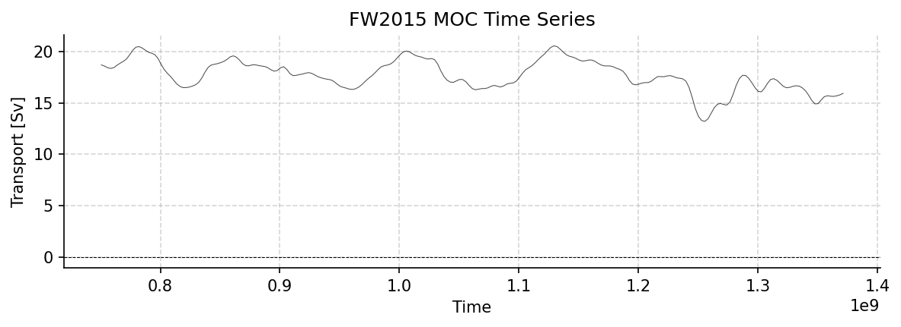

FW2015 Dataset Report
=====================

Generated: 2026-02-06 17:31:19

MOCproxy_for_figshare_v1.mat
----------------------------

Dataset Overview
^^^^^^^^^^^^^^^^

- **Project**: Unknown
- **Institution**: Unknown
- **Description**: Estimating the Atlantic overturning at 26°N using satellite altimetry and cable measurements
- **Source File**: MOCproxy_for_figshare_v1.mat
- **Data Product**: Time series of MOC
- **Time Coverage**: 727056000.0 to 1418601600.0
- **Record Length**: 264 observations (691545600.0 years)
- **Sampling Frequency**: 64281600.0H

**Citation:**

    Frajka-Williams, E. (2015), Estimating the Atlantic overturning at 26°N using satellite altimetry and cable measurements. Geophys. Res. Lett., 42, 3458–3464. doi: http://doi.org/10.1002/2015GL063220.

Dataset Statistics
^^^^^^^^^^^^^^^^^^

- **Total Variables**: 11
- **Total Coordinates**: 1
- **Dataset Size**: 0.02 MB

Coordinate Information
^^^^^^^^^^^^^^^^^^^^^^

The following table shows information about the dataset coordinates:

+------------+-------------------+-----------------------------------------+------------------------------------+--------+------------+------------+-----------+
| Coordinate | Standardized Name | Description                             | Units                              | Size   | Min Value  | Max Value  | Missing % |
+============+===================+=========================================+====================================+========+============+============+===========+
| TIME       | TIME              | Time elapsed since 1970-01-01T00:00:00Z | seconds since 1970-01-01T00:00:00Z | (264,) | 1993-01-15 | 2014-12-15 | 0.0%      |
+------------+-------------------+-----------------------------------------+------------------------------------+--------+------------+------------+-----------+

Variable Mapping and Statistics
^^^^^^^^^^^^^^^^^^^^^^^^^^^^^^^

The following table shows the mapping from original variable names to standardized names,
along with key statistics for each variable.

+-------------------+-------------------+---------------------------------------------------------------------------------------------------------------------------------------------------------------------------+---------+--------+-----------+-----------+-----------+
| Original Variable | Standardized Name | Description                                                                                                                                                               | Units   | Size   | Min Value | Max Value | Missing % |
+===================+===================+===========================================================================================================================================================================+=========+========+===========+===========+===========+
| MOC_PROXY         | MOC_PROXY         | **Overturning transport proxy**: a proxy for the meridional overturning circulation at 26N, using sea level anomaly and cable measurements                                | Sv      | (264,) | 13.21     | 20.54     | 10.2%     |
+-------------------+-------------------+---------------------------------------------------------------------------------------------------------------------------------------------------------------------------+---------+--------+-----------+-----------+-----------+
| EK                | EK                | **Ekman transport**: Surface meridional (north-south) Ekman transport as estimated from ERA-Interim reanalysis winds.                                                     | Sv      | (264,) | 1.64      | 5.11      | 6.1%      |
+-------------------+-------------------+---------------------------------------------------------------------------------------------------------------------------------------------------------------------------+---------+--------+-----------+-----------+-----------+
| H1UMO             | H1UMO             | No description available                                                                                                                                                  | unknown | (264,) | -3.17     | 6.12      | 10.2%     |
+-------------------+-------------------+---------------------------------------------------------------------------------------------------------------------------------------------------------------------------+---------+--------+-----------+-----------+-----------+
| GS                | GS                | **Gulf Stream transport**: The strength of the Gulf Stream transport through the Florida Straits between Florida and Bahamas, as measured by a submarine telephone cable. | Sv      | (264,) | 30.19     | 34.61     | 3.8%      |
+-------------------+-------------------+---------------------------------------------------------------------------------------------------------------------------------------------------------------------------+---------+--------+-----------+-----------+-----------+
| UMO_PROXY         | UMO_PROXY         | **Upper mid-ocean transport proxy**: a proxy for the upper mid-ocean transport based on the linear regression between recon.h1umo and mocgrid.umo                         | Sv      | (264,) | -19.51    | -15.16    | 10.2%     |
+-------------------+-------------------+---------------------------------------------------------------------------------------------------------------------------------------------------------------------------+---------+--------+-----------+-----------+-----------+
| MOC_GRID          | MOC_GRID          | No description available                                                                                                                                                  | unknown | (264,) | 12.98     | 19.95     | 61.0%     |
+-------------------+-------------------+---------------------------------------------------------------------------------------------------------------------------------------------------------------------------+---------+--------+-----------+-----------+-----------+
| EK_GRID           | EK_GRID           | No description available                                                                                                                                                  | unknown | (264,) | 1.97      | 4.42      | 61.0%     |
+-------------------+-------------------+---------------------------------------------------------------------------------------------------------------------------------------------------------------------------+---------+--------+-----------+-----------+-----------+
| GS_GRID           | GS_GRID           | No description available                                                                                                                                                  | unknown | (264,) | 30.61     | 32.13     | 61.0%     |
+-------------------+-------------------+---------------------------------------------------------------------------------------------------------------------------------------------------------------------------+---------+--------+-----------+-----------+-----------+
| LNADW_GRID        | LNADW_GRID        | No description available                                                                                                                                                  | unknown | (264,) | -8.34     | -3.21     | 61.0%     |
+-------------------+-------------------+---------------------------------------------------------------------------------------------------------------------------------------------------------------------------+---------+--------+-----------+-----------+-----------+
| UMO_GRID          | UMO_GRID          | No description available                                                                                                                                                  | unknown | (264,) | -20.18    | -15.31    | 61.0%     |
+-------------------+-------------------+---------------------------------------------------------------------------------------------------------------------------------------------------------------------------+---------+--------+-----------+-----------+-----------+
| UNADW_GRID        | UNADW_GRID        | No description available                                                                                                                                                  | unknown | (264,) | -12.89    | -10.79    | 61.0%     |
+-------------------+-------------------+---------------------------------------------------------------------------------------------------------------------------------------------------------------------------+---------+--------+-----------+-----------+-----------+

Dataset Visualization
^^^^^^^^^^^^^^^^^^^^^

   Time series plot for FW2015 dataset.

Complete Metadata
^^^^^^^^^^^^^^^^^

The following metadata provides comprehensive information about this dataset:

- **Time Coverage Start**: 727056000.0
- **Time Coverage End**: 1418601600.0
- **Web Link**: https://figshare.com/articles/dataset/MOCproxy_for_figshare_v1_0_mat/1463479?file=3369779
- **Comment**: Dataset accessed and processed via http://github.com/AMOCcommunity/amocatlas
- **Featuretype**: timeSeries
- **Description**: Estimating the Atlantic overturning at 26°N using satellite altimetry and cable measurements
- **License**: CC-BY 4.0
- **Conventions**: CF-1.8, ACDD-1.3
- **Data Product**: Time series of MOC
- **Created**: Jun 2015, Eleanor Frajka-Williams
- **Url**: http://eleanorfrajka.com/moc-from-space/
- **Paper**: http://dx.doi.org/10.1002/2015GL063220
- **Version**: v1.0
- **Source File**: MOCproxy_for_figshare_v1.mat
- **Source Path**: /Users/eddifying/Cloudfree/github/AMOCatlas/data/MOCproxy_for_figshare_v1.mat
- **Amocatlas Datasource**: fw2015
- **Summary**: Estimating the Atlantic overturning at 26°N using satellite altimetry and cable measurements
- **Featuretype Vocabulary**: https://cfconventions.org/cf-conventions/v1.6.0/cf-conventions.html#_features_and_feature_types

Metadata Processing Changes
^^^^^^^^^^^^^^^^^^^^^^^^^^^

*No metadata modifications detected.*
