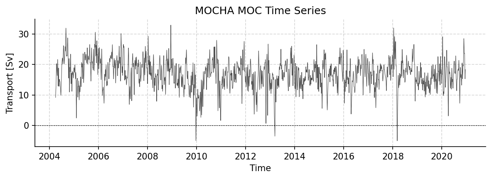

MOCHA Dataset Report
====================

Generated: 2026-02-06 16:35:18

mocha_mht_data_ERA5_v2020.nc
----------------------------

Dataset Overview
^^^^^^^^^^^^^^^^

- **Project**: RAPID-MOCHA
- **Institution**: Unknown
- **Description**: No description available
- **DOI**: https://doi.org/10.17604/3nfq-va20
- **Source File**: mocha_mht_data_ERA5_v2020.nc
- **Data Product**: MOCHA heat transport at 26.5°N
- **Time Coverage**: 2004-04-02 to 2020-12-14
- **Record Length**: 12,202 observations (16.7 years)
- **Sampling Frequency**: 12H

Dataset Statistics
^^^^^^^^^^^^^^^^^^

- **Total Variables**: 26
- **Total Coordinates**: 1
- **Dataset Size**: 116.10 MB

Coordinate Information
^^^^^^^^^^^^^^^^^^^^^^

The following table shows information about the dataset coordinates:

+------------+-------------------+-------------+------------------------------------+-------+------------+------------+-----------+
| Coordinate | Standardized Name | Description | Units                              | Size  | Min Value  | Max Value  | Missing % |
+============+===================+=============+====================================+=======+============+============+===========+
| TIME       | TIME              | time        | seconds since 1970-01-01T00:00:00Z | 12202 | 2004-04-02 | 2020-12-14 | 0.0%      |
+------------+-------------------+-------------+------------------------------------+-------+------------+------------+-----------+

Variable Mapping and Statistics
^^^^^^^^^^^^^^^^^^^^^^^^^^^^^^^

The following table shows the mapping from original variable names to standardized names,
along with key statistics for each variable.

No variable mapping information available.

Dataset Visualization
^^^^^^^^^^^^^^^^^^^^^

   Time series plot for MOCHA dataset.

Complete Metadata
^^^^^^^^^^^^^^^^^

The following metadata provides comprehensive information about this dataset:

- **Title**: MOCHA Heat Transport Data 3/29/2004-12/14/2020
- **Platform**: mooring
- **Platform Vocabulary**: https://vocab.nerc.ac.uk/collection/L06/
- **Time Coverage Start**: 2004-04-02
- **Time Coverage End**: 2020-12-14
- **Program**: RAPID
- **Project**: RAPID-MOCHA
- **Contributor Name**: William Johns, William Johns, William E. Johns, Shane Elipot, D. A. Smeed, B. Moat, B. King, D. L. Volkov, R. H. Smith
- **Contributor Email**: bjohns@rsmas.miami.edu, , bjohns@earth.miami.edu, ben.moat@noc.ac.uk, , , , , 
- **Contributor Id**: http://www.rsmas.miami.edu/people/faculty-index/?p=william-johns, , , , , , , , 
- **Contributor Role**: PI, creator, , , , , , , 
- **Contributing Institutions**: University of Miami
- **Contributing Institutions Vocabulary**: 
- **Contributing Institutions Role**: 
- **Contributing Institutions Role Vocabulary**: 
- **Doi**: https://doi.org/10.17604/3nfq-va20
- **Web Link**: https://mocha.earth.miami.edu/mocha/index.html, https://rapid.ac.uk/rapidmoc/
- **Comment**: Dataset accessed and processed via http://github.com/AMOCcommunity/amocatlas
- **Date Created**: 01-01-2023
- **Featuretype**: timeSeries
- **Data Product**: MOCHA heat transport at 26.5°N
- **Summary**: Total heat transport results for the first 16.8 years of the RAPID/MOCHA program, from April 2004 through December 2020.
- **Acknowledgement**: Funding source: the US National Science Foundation.
- **Methodology Reference**: W.E. Johns, S. Elipot, D.A. Smeed, B. Moat, B. King, D.L. Volkov, R.H. Smith, “Towards Two Decades of Atlantic Ocean Mass and Heat Transports at 26.5ºN”, accepted for publication in Royal Society Philosophical Transactions A, 2023.
- **Methodology Doi**: doi: 10.1098/rsta.2022.0188
- **Source File**: mocha_mht_data_ERA5_v2020.nc
- **Source Path**: /Users/eddifying/Cloudfree/github/AMOCatlas/data/mocha_mht_data_ERA5_v2020.nc
- **Amocatlas Datasource**: mocha26n
- **License**: ODC-By
- **Featuretype Vocabulary**: https://cfconventions.org/cf-conventions/v1.6.0/cf-conventions.html#_features_and_feature_types

Metadata Processing Changes
^^^^^^^^^^^^^^^^^^^^^^^^^^^

*No metadata modifications detected.*
