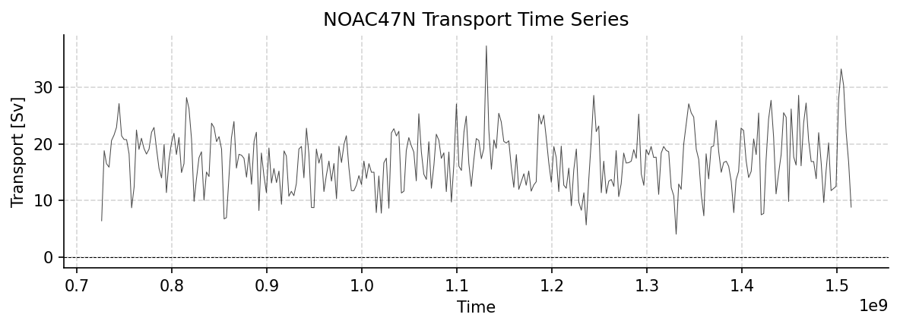

NOAC47N Dataset Report
======================

Generated: 2026-02-06 17:31:26

NOAC_AMOC.tab
-------------

Dataset Overview
^^^^^^^^^^^^^^^^

- **Project**: Meridional Connectivity of a 25-Year Observational AMOC Record at 47°N
- **Institution**: Unknown
- **Description**: No description available
- **Source File**: NOAC_AMOC.tab
- **Data Product**: Basin-wide AMOC volume transport from the NOAC array at 47°N in the subpolar North Atlantic (1993-2018)
- **Time Coverage**: 725846400.0 to 1514764800.0
- **Record Length**: 301 observations (788918400.0 years)
- **Sampling Frequency**: 64281600.0H

Dataset Statistics
^^^^^^^^^^^^^^^^^^

- **Total Variables**: 2
- **Total Coordinates**: 1
- **Dataset Size**: 0.01 MB

Coordinate Information
^^^^^^^^^^^^^^^^^^^^^^

The following table shows information about the dataset coordinates:

+------------+-------------------+-----------------------------------------+------------------------------------+--------+------------+------------+-----------+
| Coordinate | Standardized Name | Description                             | Units                              | Size   | Min Value  | Max Value  | Missing % |
+============+===================+=========================================+====================================+========+============+============+===========+
| TIME       | TIME              | Time elapsed since 1970-01-01T00:00:00Z | seconds since 1970-01-01T00:00:00Z | (301,) | 1993-01-01 | 2018-01-01 | 0.0%      |
+------------+-------------------+-----------------------------------------+------------------------------------+--------+------------+------------+-----------+

Variable Mapping and Statistics
^^^^^^^^^^^^^^^^^^^^^^^^^^^^^^^

The following table shows the mapping from original variable names to standardized names,
along with key statistics for each variable.

No variable mapping information available.

Dataset Visualization
^^^^^^^^^^^^^^^^^^^^^

   Time series plot for NOAC47N dataset.

Complete Metadata
^^^^^^^^^^^^^^^^^

The following metadata provides comprehensive information about this dataset:

- **Time Coverage Start**: 725846400.0
- **Time Coverage End**: 1514764800.0
- **Program**: NOAC 47N array
- **Project**: Meridional Connectivity of a 25-Year Observational AMOC Record at 47°N
- **Contributor Name**: Wett, Simon, Rhein, Monika, Kieke, Dagmar, Mertens, Christian, Moritz, Martin, Nowitzki, Hannah
- **Contributor Email**: , , , , , , , , , , , 
- **Contributor Id**: , , , , , , , , , , , 
- **Contributor Role**: 
- **Contributor Role Vocabulary**: http://vocab.nerc.ac.uk/search_nvs/W08/
- **Web Link**: https://doi.pangaea.de/10.1594/PANGAEA.959558
- **Comment**: Dataset accessed and processed via http://github.com/AMOCcommunity/amocatlas
- **Featuretype**: timeSeries
- **Data Product**: Basin-wide AMOC volume transport from the NOAC array at 47°N in the subpolar North Atlantic (1993-2018)
- **Source File**: NOAC_AMOC.tab
- **Source Path**: /Users/eddifying/Cloudfree/github/AMOCatlas/data/NOAC_AMOC.tab
- **Amocatlas Datasource**: noac47n
- **Acknowledgement**: S. Wett et al. (2023), https://doi.org/10.1594/PANGAEA.959558
- **References**: Wett, S., Rhein, M., Kieke, D., Mertens, C., & Moritz, M. (2023). Meridional connectivity of a 25-year observational AMOC record at 47°N. Geophysical Research Letters, 50, e2023GL103284. https://doi.org/10.1029/2023GL103284
- **License**: None
- **Summary**: 
- **Featuretype Vocabulary**: https://cfconventions.org/cf-conventions/v1.6.0/cf-conventions.html#_features_and_feature_types

Metadata Processing Changes
^^^^^^^^^^^^^^^^^^^^^^^^^^^

*No metadata modifications detected.*
