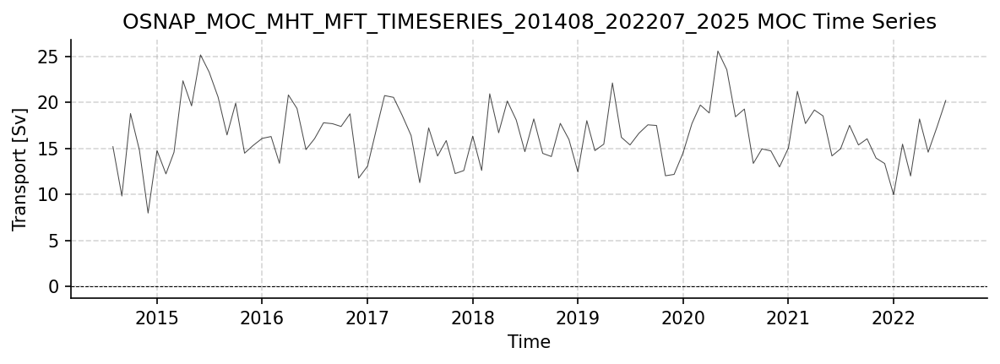

OSNAP Dataset Report
====================

Generated: 2026-02-06

This report covers all available OSNAP datasets.

OSNAP_MOC_MHT_MFT_TimeSeries_201408_202207_2025.nc
--------------------------------------------------

Dataset Overview
^^^^^^^^^^^^^^^^

- **Project**: Overturning in the Subpolar North Atlantic Program (OSNAP)
- **Institution**: Unknown
- **Description**: OSNAP transport and hydrographic estimates dataset, 2014-2020
- **DOI**: https://doi.org/10.35090/gatech/70342
- **Source File**: OSNAP_MOC_MHT_MFT_TimeSeries_201408_202207_2025.nc
- **Data Product**: Time series of MOC, MHT, and MFT (2014-2022)
- **Time Coverage**: 2014-08-01 to 2022-07-01
- **Record Length**: 96 observations (7.9 years)
- **Sampling Frequency**: 744.0H

**Citation:**

    OSNAP data were collected and made freely available by the OSNAP (Overturning in the Subpolar North Atlantic Program) project and all the national programs that contribute to it (www.o-snap.org)

Dataset Statistics
^^^^^^^^^^^^^^^^^^

- **Total Variables**: 18
- **Total Coordinates**: 1
- **Dataset Size**: 0.01 MB

Coordinate Information
^^^^^^^^^^^^^^^^^^^^^^

The following table shows information about the dataset coordinates:

+------------+-------------------+---------------------+------------------------------------+------+------------+------------+-----------+
| Coordinate | Standardized Name | Description         | Units                              | Size | Min Value  | Max Value  | Missing % |
+============+===================+=====================+====================================+======+============+============+===========+
| TIME       | TIME              | time of measurement | seconds since 1970-01-01T00:00:00Z | 96   | 2014-08-01 | 2022-07-01 | 0.0%      |
+------------+-------------------+---------------------+------------------------------------+------+------------+------------+-----------+

Variable Mapping and Statistics
^^^^^^^^^^^^^^^^^^^^^^^^^^^^^^^

The following table shows the mapping from original variable names to standardized names,
along with key statistics for each variable.

No variable mapping information available.

Dataset Visualization
^^^^^^^^^^^^^^^^^^^^^

   Time series plot for OSNAP_MOC_MHT_MFT_TIMESERIES_201408_202207_2025 dataset.

Complete Metadata
^^^^^^^^^^^^^^^^^

The following metadata provides comprehensive information about this dataset:

- **Title**: OSNAP MOC MHT MFT time series (2014-2022)
- **Platform**: mooring
- **Platform Vocabulary**: https://vocab.nerc.ac.uk/collection/L06/
- **Time Coverage Start**: 2014-08-01
- **Time Coverage End**: 2022-07-01
- **Program**: OSNAP
- **Project**: Overturning in the Subpolar North Atlantic Program (OSNAP)
- **Contributor Name**: Yao Fu, M. Susan Lozier, Amy Bower, Kristin Burmeister, Tiago Carrilho Biló, Frederic Cyr, Stuart A. Cunningham, Brad deYoung, Ahmad Fehmi Dilmahamod, M. Femke de Jong, Nora Fried, N. Penny Holliday, Neil Fraser, William E. Johns, Feili Li, Johannes Karstensen, Robert S. Pickart, Fiammetta Straneo, Igor Yashayaev, M. Susan Lozier, Yao Fu, OSNAP investigators
- **Contributor Email**: , , , , , , , , , , , , , , , , , , , susan.lozier@gatech.edu, yaofu@usf.edu, 
- **Contributor Id**: , , , , , , , , , , , , , , , , , , , , , 
- **Contributor Role**: data design, collection and/or processing
- **Contributing Institutions**: Georgia Institute of Technology, USA, National Oceanography Centre at Southampton, UK, Woods Hole Oceanographic Institution, USA, Scottish Association for Marine Science, UK, Royal Netherlands Institute for Sea Research and Utrecht University, Netherlands, Memorial University, Canada, Fisheries and Oceans Canada Northwest Atlantic Fisheries Centre and Institute of Ocean Sciences, Canada, Scripps Institution of Oceanography, UCSD, USA, University of Miami, USA, GEOMAR Helmholtz Centre for Ocean Research Kiel, Germany, Bedford Institute of Oceanography, Canada, Xiamen University, China, University of South Florida, USA, Multiple contributing institutions (US, UK, Germany, Netherlands, Canada, France, China)
- **Contributing Institutions Vocabulary**: , , , , , , , , , , , , , 
- **Contributing Institutions Role**: 
- **Contributing Institutions Role Vocabulary**: 
- **Doi**: https://doi.org/10.35090/gatech/70342
- **Web Link**: https://www.o-snap.org
- **Comment**: Dataset accessed and processed via http://github.com/AMOCcommunity/amocatlas
- **Date Created**: 2025-05-21 15:09:24
- **Featuretype**: timeSeries
- **Acknowledgement**: OSNAP data were collected and made freely available by the OSNAP (Overturning in the Subpolar North Atlantic Program) project and all the national programs that contribute to it (www.o-snap.org).
- **Data Product**: Time series of MOC, MHT, and MFT (2014-2022)
- **Dataset Version**: 2025
- **Processing Software**: MATLAB R2024b
- **Data Assembly Center**: Georgia Institute of Technology
- **References**: Lozier et al. (2019), Science, doi:10.1126/science.aau6592; Li et al. (2017), JTECH, doi:10.1175/JTECH-D-16-0247.1; Li et al. (2021), Nature Communications, doi:10.1038/s41467-021-23350-2; Fu et al. (2023), Communications Earth & Environment, doi:10.1038/s43247-023-00848-9
- **Source File**: OSNAP_MOC_MHT_MFT_TimeSeries_201408_202207_2025.nc
- **Source Path**: /Users/eddifying/Cloudfree/github/AMOCatlas/data/OSNAP_MOC_MHT_MFT_TimeSeries_201408_202207_2025.nc
- **Amocatlas Datasource**: osnap55n
- **Description**: OSNAP transport and hydrographic estimates dataset, 2014-2020
- **License**: Creative Commons Attribution 4.0 International (CC BY 4.0)
- **Conventions**: CF-1.8, ACDD-1.3
- **Data Policy**: Any person making use of OSNAP observational data and/or numerical results must communicate with the responsible investigators at the start of the analysis and anticipate that the data collectors will be co-authors of published results. In cases where investigators choose not to be co-authors on publications that rely on their data, the parties responsible for collecting the data and the sponsoring funding agencies should be acknowledged, including reference to any relevant publications by the originating authors describing the data sets and a reference to the data set itself using its DOI. OSNAP data are intended for scholarly use by the academic and scientific community, with the express understanding that any such use will properly acknowledge the originating investigator.
- **Summary**: OSNAP transport and hydrographic estimates dataset, 2014-2020
- **Featuretype Vocabulary**: https://cfconventions.org/cf-conventions/v1.6.0/cf-conventions.html#_features_and_feature_types

Metadata Processing Changes
^^^^^^^^^^^^^^^^^^^^^^^^^^^

*No metadata modifications detected.*

OSNAP_Streamfunction_201408_202207_2025.nc
------------------------------------------

Dataset Overview
^^^^^^^^^^^^^^^^

- **Project**: Overturning in the Subpolar North Atlantic Program (OSNAP)
- **Institution**: Unknown
- **Description**: OSNAP transport and hydrographic estimates dataset, 2014-2020
- **DOI**: https://doi.org/10.35090/gatech/70342
- **Source File**: OSNAP_Streamfunction_201408_202207_2025.nc
- **Data Product**: Meridional overturning streamfunction (2014-2022)
- **Time Coverage**: 2014-08-01 to 2022-07-01
- **Record Length**: 96 observations (7.9 years)
- **Sampling Frequency**: 744.0H

**Citation:**

    OSNAP data were collected and made freely available by the OSNAP (Overturning in the Subpolar North Atlantic Program) project and all the national programs that contribute to it (www.o-snap.org)

Dataset Statistics
^^^^^^^^^^^^^^^^^^

- **Total Variables**: 3
- **Total Coordinates**: 2
- **Dataset Size**: 1.06 MB

Coordinate Information
^^^^^^^^^^^^^^^^^^^^^^

The following table shows information about the dataset coordinates:

+------------+-------------------+---------------------------------------+------------------------------------+------+------------+------------+-----------+
| Coordinate | Standardized Name | Description                           | Units                              | Size | Min Value  | Max Value  | Missing % |
+============+===================+=======================================+====================================+======+============+============+===========+
| TIME       | TIME              | time of measurement                   | seconds since 1970-01-01T00:00:00Z | 96   | 2014-08-01 | 2022-07-01 | 0.0%      |
+------------+-------------------+---------------------------------------+------------------------------------+------+------------+------------+-----------+
| LEVEL      | LEVEL             | potential density Sigma_Theta surface | kg m^-3                            | 481  | 23.30      | 28.10      | 0.0%      |
+------------+-------------------+---------------------------------------+------------------------------------+------+------------+------------+-----------+

Variable Mapping and Statistics
^^^^^^^^^^^^^^^^^^^^^^^^^^^^^^^

The following table shows the mapping from original variable names to standardized names,
along with key statistics for each variable.

No variable mapping information available.

Complete Metadata
^^^^^^^^^^^^^^^^^

The following metadata provides comprehensive information about this dataset:

- **Title**: OSNAP Streamfunction (2014-2022)
- **Platform**: mooring
- **Platform Vocabulary**: https://vocab.nerc.ac.uk/collection/L06/
- **Time Coverage Start**: 2014-08-01
- **Time Coverage End**: 2022-07-01
- **Program**: OSNAP
- **Project**: Overturning in the Subpolar North Atlantic Program (OSNAP)
- **Contributor Name**: Yao Fu, M. Susan Lozier, Amy Bower, Kristin Burmeister, Tiago Carrilho Biló, Frederic Cyr, Stuart A. Cunningham, Brad deYoung, Ahmad Fehmi Dilmahamod, M. Femke de Jong, Nora Fried, N. Penny Holliday, Neil Fraser, William E. Johns, Feili Li, Johannes Karstensen, Robert S. Pickart, Fiammetta Straneo, Igor Yashayaev, M. Susan Lozier, Yao Fu, OSNAP investigators
- **Contributor Email**: , , , , , , , , , , , , , , , , , , , susan.lozier@gatech.edu, yaofu@usf.edu, 
- **Contributor Id**: , , , , , , , , , , , , , , , , , , , , , 
- **Contributor Role**: data design, collection and/or processing
- **Contributing Institutions**: Georgia Institute of Technology, USA, National Oceanography Centre at Southampton, UK, Woods Hole Oceanographic Institution, USA, Scottish Association for Marine Science, UK, Royal Netherlands Institute for Sea Research and Utrecht University, Netherlands, Memorial University, Canada, Fisheries and Oceans Canada Northwest Atlantic Fisheries Centre and Institute of Ocean Sciences, Canada, Scripps Institution of Oceanography, UCSD, USA, University of Miami, USA, GEOMAR Helmholtz Centre for Ocean Research Kiel, Germany, Bedford Institute of Oceanography, Canada, Xiamen University, China, University of South Florida, USA, Multiple contributing institutions (US, UK, Germany, Netherlands, Canada, France, China)
- **Contributing Institutions Vocabulary**: , , , , , , , , , , , , , 
- **Contributing Institutions Role**: 
- **Contributing Institutions Role Vocabulary**: 
- **Doi**: https://doi.org/10.35090/gatech/70342
- **Web Link**: https://www.o-snap.org
- **Comment**: Dataset accessed and processed via http://github.com/AMOCcommunity/amocatlas
- **Date Created**: 2025-05-21 15:16:52
- **Featuretype**: timeSeries
- **Acknowledgement**: OSNAP data were collected and made freely available by the OSNAP (Overturning in the Subpolar North Atlantic Program) project and all the national programs that contribute to it (www.o-snap.org).
- **Data Product**: Meridional overturning streamfunction (2014-2022)
- **Dataset Version**: 2025
- **Processing Software**: MATLAB R2024b
- **Data Assembly Center**: Georgia Institute of Technology
- **References**: Lozier et al. (2019), Science, doi:10.1126/science.aau6592; Li et al. (2017), JTECH, doi:10.1175/JTECH-D-16-0247.1; Li et al. (2021), Nature Communications, doi:10.1038/s41467-021-23350-2; Fu et al. (2023), Communications Earth & Environment, doi:10.1038/s43247-023-00848-9
- **Source File**: OSNAP_Streamfunction_201408_202207_2025.nc
- **Source Path**: /Users/eddifying/Cloudfree/github/AMOCatlas/data/OSNAP_Streamfunction_201408_202207_2025.nc
- **Amocatlas Datasource**: osnap55n
- **Description**: OSNAP transport and hydrographic estimates dataset, 2014-2020
- **License**: Creative Commons Attribution 4.0 International (CC BY 4.0)
- **Conventions**: CF-1.8, ACDD-1.3
- **Data Policy**: Any person making use of OSNAP observational data and/or numerical results must communicate with the responsible investigators at the start of the analysis and anticipate that the data collectors will be co-authors of published results. In cases where investigators choose not to be co-authors on publications that rely on their data, the parties responsible for collecting the data and the sponsoring funding agencies should be acknowledged, including reference to any relevant publications by the originating authors describing the data sets and a reference to the data set itself using its DOI. OSNAP data are intended for scholarly use by the academic and scientific community, with the express understanding that any such use will properly acknowledge the originating investigator.
- **Summary**: OSNAP transport and hydrographic estimates dataset, 2014-2020
- **Featuretype Vocabulary**: https://cfconventions.org/cf-conventions/v1.6.0/cf-conventions.html#_features_and_feature_types

Metadata Processing Changes
^^^^^^^^^^^^^^^^^^^^^^^^^^^

*No metadata modifications detected.*

OSNAP_Gridded_TSV_201408_202207_2025.nc
---------------------------------------

Dataset Overview
^^^^^^^^^^^^^^^^

- **Project**: Overturning in the Subpolar North Atlantic Program (OSNAP)
- **Institution**: Unknown
- **Description**: OSNAP transport and hydrographic estimates dataset, 2014-2020
- **DOI**: https://doi.org/10.35090/gatech/70342
- **Source File**: OSNAP_Gridded_TSV_201408_202207_2025.nc
- **Data Product**: Gridded velocity, temperature, and salinity (2014-2022)
- **Time Coverage**: 2014-08-01 to 2022-07-01
- **Record Length**: 96 observations (7.9 years)
- **Sampling Frequency**: 744.0H

**Citation:**

    OSNAP data were collected and made freely available by the OSNAP (Overturning in the Subpolar North Atlantic Program) project and all the national programs that contribute to it (www.o-snap.org)

Dataset Statistics
^^^^^^^^^^^^^^^^^^

- **Total Variables**: 3
- **Total Coordinates**: 4
- **Dataset Size**: 55.97 MB

Coordinate Information
^^^^^^^^^^^^^^^^^^^^^^

The following table shows information about the dataset coordinates:

+------------+-------------------+--------------------------+------------------------------------+------+------------+------------+-----------+
| Coordinate | Standardized Name | Description              | Units                              | Size | Min Value  | Max Value  | Missing % |
+============+===================+==========================+====================================+======+============+============+===========+
| TIME       | TIME              | time of measurement      | seconds since 1970-01-01T00:00:00Z | 96   | 2014-08-01 | 2022-07-01 | 0.0%      |
+------------+-------------------+--------------------------+------------------------------------+------+------------+------------+-----------+
| LATITUDE   | LATITUDE          | latitude of measurement  | degree_north                       | 256  | 52.02      | 60.23      | 0.0%      |
+------------+-------------------+--------------------------+------------------------------------+------+------------+------------+-----------+
| LONGITUDE  | LONGITUDE         | longitude of measurement | degree_east                        | 256  | -56.88     | -6.12      | 0.0%      |
+------------+-------------------+--------------------------+------------------------------------+------+------------+------------+-----------+
| DEPTH      | DEPTH             | depth of measurement     | meter                              | 199  | 15.00      | 3975.00    | 0.0%      |
+------------+-------------------+--------------------------+------------------------------------+------+------------+------------+-----------+

Variable Mapping and Statistics
^^^^^^^^^^^^^^^^^^^^^^^^^^^^^^^

The following table shows the mapping from original variable names to standardized names,
along with key statistics for each variable.

No variable mapping information available.

Complete Metadata
^^^^^^^^^^^^^^^^^

The following metadata provides comprehensive information about this dataset:

- **Title**: OSNAP Gridded Temperature Salinity and Velocity data 2014-2020
- **Platform**: mooring
- **Platform Vocabulary**: https://vocab.nerc.ac.uk/collection/L06/
- **Time Coverage Start**: 2014-08-01
- **Time Coverage End**: 2022-07-01
- **Program**: OSNAP
- **Project**: Overturning in the Subpolar North Atlantic Program (OSNAP)
- **Contributor Name**: Yao Fu, M. Susan Lozier, Amy Bower, Kristin Burmeister, Tiago Carrilho Biló, Frederic Cyr, Stuart A. Cunningham, Brad deYoung, Ahmad Fehmi Dilmahamod, M. Femke de Jong, Nora Fried, N. Penny Holliday, Neil Fraser, William E. Johns, Feili Li, Johannes Karstensen, Robert S. Pickart, Fiammetta Straneo, Igor Yashayaev, M. Susan Lozier, Yao Fu, OSNAP investigators
- **Contributor Email**: , , , , , , , , , , , , , , , , , , , susan.lozier@gatech.edu, yaofu@usf.edu, 
- **Contributor Id**: , , , , , , , , , , , , , , , , , , , , , 
- **Contributor Role**: data design, collection and/or processing
- **Contributing Institutions**: Georgia Institute of Technology, USA, National Oceanography Centre at Southampton, UK, Woods Hole Oceanographic Institution, USA, Scottish Association for Marine Science, UK, Royal Netherlands Institute for Sea Research and Utrecht University, Netherlands, Memorial University, Canada, Fisheries and Oceans Canada Northwest Atlantic Fisheries Centre and Institute of Ocean Sciences, Canada, Scripps Institution of Oceanography, UCSD, USA, University of Miami, USA, GEOMAR Helmholtz Centre for Ocean Research Kiel, Germany, Bedford Institute of Oceanography, Canada, Xiamen University, China, University of South Florida, USA, Multiple contributing institutions (US, UK, Germany, Netherlands, Canada, France, China)
- **Contributing Institutions Vocabulary**: , , , , , , , , , , , , , 
- **Contributing Institutions Role**: 
- **Contributing Institutions Role Vocabulary**: 
- **Doi**: https://doi.org/10.35090/gatech/70342
- **Web Link**: https://www.o-snap.org
- **Comment**: Dataset accessed and processed via http://github.com/AMOCcommunity/amocatlas
- **Date Created**: 2025-05-21 15:11:05
- **Featuretype**: timeSeries
- **Acknowledgement**: OSNAP data were collected and made freely available by the OSNAP (Overturning in the Subpolar North Atlantic Program) project and all the national programs that contribute to it (www.o-snap.org).
- **Data Product**: Gridded velocity, temperature, and salinity (2014-2022)
- **Dataset Version**: 2025
- **Processing Software**: MATLAB R2024b
- **File Size**: 55.98 MB
- **Data Assembly Center**: Georgia Institute of Technology
- **References**: Lozier et al. (2019), Science, doi:10.1126/science.aau6592; Li et al. (2017), JTECH, doi:10.1175/JTECH-D-16-0247.1; Li et al. (2021), Nature Communications, doi:10.1038/s41467-021-23350-2; Fu et al. (2023), Communications Earth & Environment, doi:10.1038/s43247-023-00848-9
- **Source File**: OSNAP_Gridded_TSV_201408_202207_2025.nc
- **Source Path**: /Users/eddifying/Cloudfree/github/AMOCatlas/data/OSNAP_Gridded_TSV_201408_202207_2025.nc
- **Amocatlas Datasource**: osnap55n
- **Description**: OSNAP transport and hydrographic estimates dataset, 2014-2020
- **License**: Creative Commons Attribution 4.0 International (CC BY 4.0)
- **Conventions**: CF-1.8, ACDD-1.3
- **Data Policy**: Any person making use of OSNAP observational data and/or numerical results must communicate with the responsible investigators at the start of the analysis and anticipate that the data collectors will be co-authors of published results. In cases where investigators choose not to be co-authors on publications that rely on their data, the parties responsible for collecting the data and the sponsoring funding agencies should be acknowledged, including reference to any relevant publications by the originating authors describing the data sets and a reference to the data set itself using its DOI. OSNAP data are intended for scholarly use by the academic and scientific community, with the express understanding that any such use will properly acknowledge the originating investigator.
- **Summary**: OSNAP transport and hydrographic estimates dataset, 2014-2020
- **Featuretype Vocabulary**: https://cfconventions.org/cf-conventions/v1.6.0/cf-conventions.html#_features_and_feature_types

Metadata Processing Changes
^^^^^^^^^^^^^^^^^^^^^^^^^^^

*No metadata modifications detected.*
