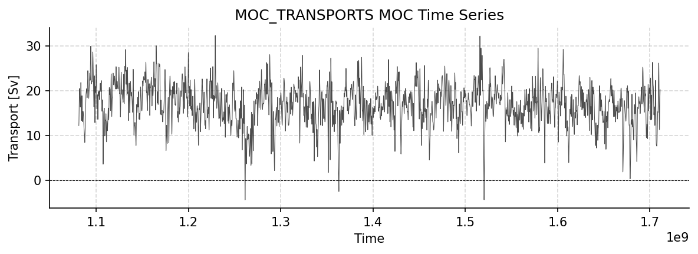
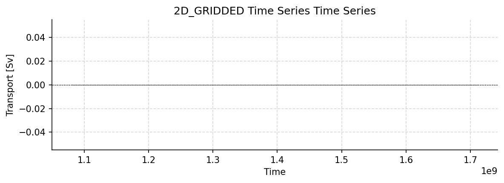
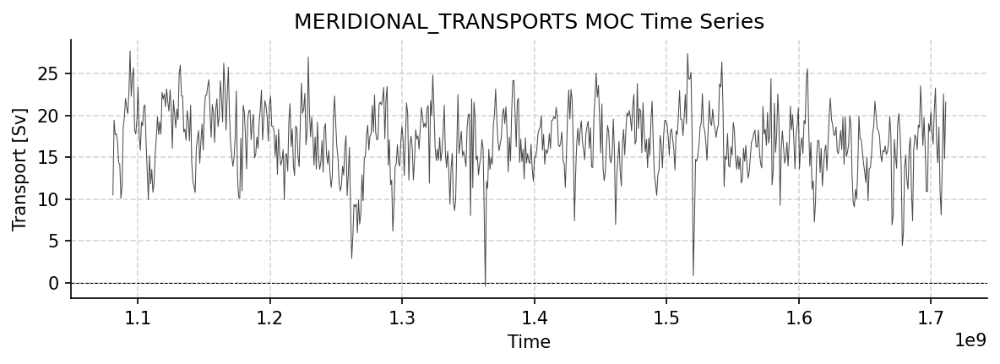

RAPID Dataset Report
====================

Generated: 2026-02-06 23:26:11

This report covers all available RAPID datasets.

moc_transports.nc
-----------------

Dataset Overview
^^^^^^^^^^^^^^^^

- **Project**: RAPID-AMOC 26°N array
- **Description**: RAPID 26N transport estimates dataset
- **Citation**: Moat B.I.; Smeed D.A.; Rayner D.; Johns W.E.; Smith, R.; Volkov, D.; Elipot S.; Petit T.; Kajtar J.; Baringer M. O.; and Collins, J. (2026). Atlantic meridional overturning circulation observed by the RAPID-MOCHA-WBTS (RAPID-Meridional Overturning Circulation and Heatflux Array-Western Boundary Time Series) array at 26N from 2004 to 2024 (v2024.1a), British Oceanographic Data Centre - Natural Environment Research Council, UK. doi: 10.5285/48d0bf43-0598-ceb2-e063-7086abc062f1
- **Acknowledgement**: The RAPID-MOC monitoring project is funded by the Natural Environment Research Council and data is freely available from www.rapid.ac.uk/
- **DOI**: https://doi.org/10.5285/223b34a32dc5c945e0637086abc0f274
- **Source File**: moc_transports.nc
- **Data Product**: RAPID layer transport time series
- **Time Coverage**: 2004-04-02 to 2024-03-27
- **Record Length**: 14,599 observations (20.0 years)
- **Sampling Frequency**: 12H

**Citation:**

    Moat B.I.; Smeed D.A.; Rayner D.; Johns W.E.; Smith, R.; Volkov, D.; Elipot S.; Petit T.; Kajtar J.; Baringer M. O.; and Collins, J. (2026). Atlantic meridional overturning circulation observed by the RAPID-MOCHA-WBTS (RAPID-Meridional Overturning Circulation and Heatflux Array-Western Boundary Time Series) array at 26N from 2004 to 2024 (v2024.1a), British Oceanographic Data Centre - Natural Environment Research Council, UK. doi: http://doi.org/10.5285/48d0bf43-0598-ceb2-e063-7086abc062f1

Dataset Statistics
^^^^^^^^^^^^^^^^^^

- **Total Variables**: 9
- **Total Coordinates**: 1
- **Dataset Size**: 1.11 MB

Coordinate Information
^^^^^^^^^^^^^^^^^^^^^^

The following table shows information about the dataset coordinates:

+------------+-------------------+-----------------------------------------+------------------------------------+----------+------------+------------+
| Coordinate | Standardized Name | Description                             | Units                              | Size     | Min Value  | Max Value  |
+============+===================+=========================================+====================================+==========+============+============+
| TIME       | TIME              | Time elapsed since 1970-01-01T00:00:00Z | seconds since 1970-01-01T00:00:00Z | (14599,) | 2004-04-02 | 2024-03-27 |
+------------+-------------------+-----------------------------------------+------------------------------------+----------+------------+------------+

Variable Mapping and Statistics
^^^^^^^^^^^^^^^^^^^^^^^^^^^^^^^

The following table shows the mapping from original variable names to standardized names,
along with key statistics for each variable.

+-------------------+-------------------+------------------------------------------------------------------------+----------+----------+-----------+-----------+-----------+
| Original Variable | Standardized Name | Description                                                            | Units    | Size     | Min Value | Max Value | Missing % |
+===================+===================+========================================================================+==========+==========+===========+===========+===========+
| t_therm10         | TRANS_0_800       | **Transport**: Thermocline recirculation 0-800m                        | Sverdrup | (14599,) | -28.85    | -7.63     | 0.1%      |
+-------------------+-------------------+------------------------------------------------------------------------+----------+----------+-----------+-----------+-----------+
| t_aiw10           | TRANS_800_1100    | **Transport**: Intermediate water 800-1100m                            | Sverdrup | (14599,) | -2.17     | 2.82      | 0.1%      |
+-------------------+-------------------+------------------------------------------------------------------------+----------+----------+-----------+-----------+-----------+
| t_ud10            | TRANS_1100_3000   | **Transport**: upper NADW 1100-3000m                                   | Sverdrup | (14599,) | -22.20    | -0.38     | 0.1%      |
+-------------------+-------------------+------------------------------------------------------------------------+----------+----------+-----------+-----------+-----------+
| t_ld10            | TRANS_3000_5000   | **Transport**: lower NADW 3000-5000m                                   | Sverdrup | (14599,) | -14.41    | 7.14      | 0.1%      |
+-------------------+-------------------+------------------------------------------------------------------------+----------+----------+-----------+-----------+-----------+
| t_bw10            | TRANS_below_5000  | **Transport**: AABW > 5000m                                            | Sverdrup | (14599,) | -0.60     | 3.46      | 0.1%      |
+-------------------+-------------------+------------------------------------------------------------------------+----------+----------+-----------+-----------+-----------+
| t_gs10            | TRANS_FC          | **Florida Straits Transport**: Florida Current from cable measurements | Sverdrup | (14599,) | 21.01     | 39.65     | 0.1%      |
+-------------------+-------------------+------------------------------------------------------------------------+----------+----------+-----------+-----------+-----------+
| t_ek10            | TRANS_EKMAN       | **Ekman Transport**: Ekman transport from wind stress                  | Sverdrup | (14599,) | -13.00    | 18.29     | 0.1%      |
+-------------------+-------------------+------------------------------------------------------------------------+----------+----------+-----------+-----------+-----------+
| t_umo10           | TRANS_UMO         | **Transport**: Upper Mid-Ocean transport                               | Sverdrup | (14599,) | -28.24    | -6.65     | 0.1%      |
+-------------------+-------------------+------------------------------------------------------------------------+----------+----------+-----------+-----------+-----------+
| moc_mar_hc10      | MOC               | **overturning transport**: MOC strength                                | Sverdrup | (14599,) | -4.35     | 32.34     | 0.1%      |
+-------------------+-------------------+------------------------------------------------------------------------+----------+----------+-----------+-----------+-----------+

Dataset Visualization
^^^^^^^^^^^^^^^^^^^^^

   Time series plot for MOC_TRANSPORTS dataset.

Complete Metadata
^^^^^^^^^^^^^^^^^

The following metadata provides comprehensive information about this dataset:

- **Title**: RAPID MOC timeseries
- **Platform**: mooring
- **Platform Vocabulary**: https://vocab.nerc.ac.uk/collection/L06/
- **Time Coverage Start**: 2004-04-02
- **Time Coverage End**: 2024-03-27
- **Program**: RAPID
- **Project**: RAPID-AMOC 26°N array
- **Contributor Name**: Ben Moat
- **Contributor Email**: ben.moat@noc.ac.uk
- **Contributor Id**: 
- **Contributor Role**: creator
- **Contributing Institutions**: National Oceanography Centre, UK
- **Contributing Institutions Vocabulary**: 
- **Contributing Institutions Role**: 
- **Contributing Institutions Role Vocabulary**: 
- **Doi**: https://doi.org/10.5285/223b34a32dc5c945e0637086abc0f274
- **Web Link**: https://rapid.ac.uk/rapidmoc
- **Comment**: Dataset accessed and processed via http://github.com/AMOCcommunity/amocatlas
- **Date Created**: 17-Sep-2024
- **Featuretype**: timeSeries
- **Description**: RAPID 26N transport estimates dataset
- **Acknowledgement**: The RAPID-MOC monitoring project is funded by the Natural Environment Research Council and data is freely available from www.rapid.ac.uk/
- **License**: CC-BY 4.0
- **Conventions**: CF-1.8, ACDD-1.3
- **Version**: 2024.1a
- **Data Product**: RAPID layer transport time series
- **Variable Mapping**: [Complex metadata structure - 10 items]
- **Source File**: moc_transports.nc
- **Source Path**: /Users/eddifying/Cloudfree/github/AMOCatlas/data/moc_transports.nc
- **Amocatlas Datasource**: rapid26n
- **Applied Variable Mapping**: [Complex metadata structure - 11 items]
- **Summary**: RAPID 26N transport estimates dataset
- **Featuretype Vocabulary**: https://cfconventions.org/cf-conventions/v1.6.0/cf-conventions.html#_features_and_feature_types

Metadata Processing Changes
^^^^^^^^^^^^^^^^^^^^^^^^^^^

**Added by AMOCatlas processing:**

- **Source Path**: /Users/eddifying/Cloudfree/github/AMOCatlas/data/moc_transports.nc
- **Amocatlas Datasource**: rapid26n
- **Time Coverage End**: 2024-03-27
- **Citation**: Moat B.I.; Smeed D.A.; Rayner D.; Johns W.E.; Smith, R.; Volkov, D.; Elipot S.; Petit T.; Kajtar J.; Baringer M. O.; and Collins, J. (2026). Atlantic meridional overturning circulation observed by the RAPID-MOCHA-WBTS (RAPID-Meridional Overturning Circulation and Heatflux Array-Western Boundary Time Series) array at 26N from 2004 to 2024 (v2024.1a), British Oceanographic Data Centre - Natural Environment Research Council, UK. doi: 10.5285/48d0bf43-0598-ceb2-e063-7086abc062f1
- **Institution**: 
- **Acknowledgement**: The RAPID-MOC monitoring project is funded by the Natural Environment Research Council and data is freely available from www.rapid.ac.uk/
- **License**: CC-BY 4.0
- **Data Product**: RAPID layer transport time series
- **Comment**: Dataset accessed and processed via http://github.com/AMOCcommunity/amocatlas
- **Source File**: moc_transports.nc
- **Variable Mapping**: {'time': 'TIME', 't_therm10': 'TRANS_0_800', 't_aiw10': 'TRANS_800_1100', 't_ud10': 'TRANS_1100_3000', 't_ld10': 'TRANS_3000_5000', 't_bw10': 'TRANS_below_5000', 't_gs10': 'TRANS_FC', 't_ek10': 'TRANS_EKMAN', 't_umo10': 'TRANS_UMO', 'moc_mar_hc10': 'MOC'}
- **Creator Name**: 
- **Platform Type**: 
- **Description**: RAPID 26N transport estimates dataset
- **Project**: RAPID-AMOC 26°N array
- **Creator Email**: 
- **Weblink**: 
- **Doi**: https://doi.org/10.5285/223b34a32dc5c945e0637086abc0f274
- **Program**: RAPID
- **Time Coverage Start**: 2004-04-01
- **Featuretype**: timeSeries
- **Conventions**: CF-1.8, ACDD-1.3

moc_vertical.nc
---------------

Dataset Overview
^^^^^^^^^^^^^^^^

- **Project**: RAPID-AMOC 26°N array
- **Description**: RAPID 26N transport estimates dataset
- **Citation**: Moat B.I.; Smeed D.A.; Rayner D.; Johns W.E.; Smith, R.; Volkov, D.; Elipot S.; Petit T.; Kajtar J.; Baringer M. O.; and Collins, J. (2026). Atlantic meridional overturning circulation observed by the RAPID-MOCHA-WBTS (RAPID-Meridional Overturning Circulation and Heatflux Array-Western Boundary Time Series) array at 26N from 2004 to 2024 (v2024.1a), British Oceanographic Data Centre - Natural Environment Research Council, UK. doi: 10.5285/48d0bf43-0598-ceb2-e063-7086abc062f1
- **Acknowledgement**: The RAPID-MOC monitoring project is funded by the Natural Environment Research Council and data is freely available from www.rapid.ac.uk/
- **DOI**: https://doi.org/10.5285/223b34a32dc5c945e0637086abc0f274
- **Source File**: moc_vertical.nc
- **Data Product**: RAPID vertical streamfunction time series
- **Time Coverage**: 2004-04-02 to 2024-03-27
- **Record Length**: 14,599 observations (20.0 years)
- **Sampling Frequency**: 12H

**Citation:**

    Moat B.I.; Smeed D.A.; Rayner D.; Johns W.E.; Smith, R.; Volkov, D.; Elipot S.; Petit T.; Kajtar J.; Baringer M. O.; and Collins, J. (2026). Atlantic meridional overturning circulation observed by the RAPID-MOCHA-WBTS (RAPID-Meridional Overturning Circulation and Heatflux Array-Western Boundary Time Series) array at 26N from 2004 to 2024 (v2024.1a), British Oceanographic Data Centre - Natural Environment Research Council, UK. doi: http://doi.org/10.5285/48d0bf43-0598-ceb2-e063-7086abc062f1

Dataset Statistics
^^^^^^^^^^^^^^^^^^

- **Total Variables**: 1
- **Total Coordinates**: 2
- **Dataset Size**: 34.31 MB

Coordinate Information
^^^^^^^^^^^^^^^^^^^^^^

The following table shows information about the dataset coordinates:

+------------+-------------------+-----------------------------------------+------------------------------------+----------+------------+------------+
| Coordinate | Standardized Name | Description                             | Units                              | Size     | Min Value  | Max Value  |
+============+===================+=========================================+====================================+==========+============+============+
| TIME       | TIME              | Time elapsed since 1970-01-01T00:00:00Z | seconds since 1970-01-01T00:00:00Z | (14599,) | 2004-04-02 | 2024-03-27 |
+------------+-------------------+-----------------------------------------+------------------------------------+----------+------------+------------+
| DEPTH      | DEPTH             | Depth below surface of the water        | meter                              | (307,)   | 0          | 6e+03      |
+------------+-------------------+-----------------------------------------+------------------------------------+----------+------------+------------+

Variable Mapping and Statistics
^^^^^^^^^^^^^^^^^^^^^^^^^^^^^^^

The following table shows the mapping from original variable names to standardized names,
along with key statistics for each variable.

+---------------------+-------------------+--------------------------------------------------------------------------+----------+--------------+-----------+-----------+-----------+
| Original Variable   | Standardized Name | Description                                                              | Units    | Size         | Min Value | Max Value | Missing % |
+=====================+===================+==========================================================================+==========+==============+===========+===========+===========+
| stream_function_mar | STREAMFUNCTION_Z  | **Meridional overturning**: Streamfunction across the Atlantic at 26.5°N | Sverdrup | (307, 14599) | -17.34    | 37.79     | 0.0%      |
+---------------------+-------------------+--------------------------------------------------------------------------+----------+--------------+-----------+-----------+-----------+

Complete Metadata
^^^^^^^^^^^^^^^^^

The following metadata provides comprehensive information about this dataset:

- **Title**: RAPID streamfunction
- **Platform**: mooring
- **Platform Vocabulary**: https://vocab.nerc.ac.uk/collection/L06/
- **Time Coverage Start**: 2004-04-02
- **Time Coverage End**: 2024-03-27
- **Program**: RAPID
- **Project**: RAPID-AMOC 26°N array
- **Contributor Name**: Ben Moat
- **Contributor Email**: ben.moat@noc.ac.uk
- **Contributor Id**: 
- **Contributor Role**: creator
- **Contributing Institutions**: National Oceanography Centre, UK
- **Contributing Institutions Vocabulary**: 
- **Contributing Institutions Role**: 
- **Contributing Institutions Role Vocabulary**: 
- **Doi**: https://doi.org/10.5285/223b34a32dc5c945e0637086abc0f274
- **Web Link**: https://rapid.ac.uk/rapidmoc
- **Comment**: Dataset accessed and processed via http://github.com/AMOCcommunity/amocatlas
- **Date Created**: 17-Sep-2024
- **Featuretype**: timeSeries
- **Description**: RAPID 26N transport estimates dataset
- **Acknowledgement**: The RAPID-MOC monitoring project is funded by the Natural Environment Research Council and data is freely available from www.rapid.ac.uk/
- **License**: CC-BY 4.0
- **Conventions**: CF-1.8, ACDD-1.3
- **Version**: 2024.1a
- **Data Product**: RAPID vertical streamfunction time series
- **Source File**: moc_vertical.nc
- **Source Path**: /Users/eddifying/Cloudfree/github/AMOCatlas/data/moc_vertical.nc
- **Variable Mapping**: {'time': 'TIME', 'depth': 'DEPTH', 'stream_function_mar': 'STREAMFUNCTION_Z'}
- **Amocatlas Datasource**: rapid26n
- **Applied Variable Mapping**: {'time': 'TIME', 'depth': 'DEPTH', 'stream_function_mar': 'STREAMFUNCTION_Z', 'TIME': 'TIME', 'DEPTH': 'DEPTH'}
- **Summary**: RAPID 26N transport estimates dataset
- **Featuretype Vocabulary**: https://cfconventions.org/cf-conventions/v1.6.0/cf-conventions.html#_features_and_feature_types

Metadata Processing Changes
^^^^^^^^^^^^^^^^^^^^^^^^^^^

**Added by AMOCatlas processing:**

- **Source Path**: /Users/eddifying/Cloudfree/github/AMOCatlas/data/moc_vertical.nc
- **Amocatlas Datasource**: rapid26n
- **Time Coverage End**: 2024-03-27
- **Citation**: Moat B.I.; Smeed D.A.; Rayner D.; Johns W.E.; Smith, R.; Volkov, D.; Elipot S.; Petit T.; Kajtar J.; Baringer M. O.; and Collins, J. (2026). Atlantic meridional overturning circulation observed by the RAPID-MOCHA-WBTS (RAPID-Meridional Overturning Circulation and Heatflux Array-Western Boundary Time Series) array at 26N from 2004 to 2024 (v2024.1a), British Oceanographic Data Centre - Natural Environment Research Council, UK. doi: 10.5285/48d0bf43-0598-ceb2-e063-7086abc062f1
- **Institution**: 
- **Acknowledgement**: The RAPID-MOC monitoring project is funded by the Natural Environment Research Council and data is freely available from www.rapid.ac.uk/
- **License**: CC-BY 4.0
- **Data Product**: RAPID vertical streamfunction time series
- **Comment**: Dataset accessed and processed via http://github.com/AMOCcommunity/amocatlas
- **Source File**: moc_vertical.nc
- **Variable Mapping**: {'time': 'TIME', 'depth': 'DEPTH', 'stream_function_mar': 'STREAMFUNCTION_Z'}
- **Creator Name**: 
- **Platform Type**: 
- **Description**: RAPID 26N transport estimates dataset
- **Project**: RAPID-AMOC 26°N array
- **Creator Email**: 
- **Weblink**: 
- **Doi**: https://doi.org/10.5285/223b34a32dc5c945e0637086abc0f274
- **Program**: RAPID
- **Time Coverage Start**: 2004-04-01
- **Featuretype**: timeSeries
- **Conventions**: CF-1.8, ACDD-1.3

ts_gridded.nc
-------------

Dataset Overview
^^^^^^^^^^^^^^^^

- **Project**: RAPID-AMOC 26°N array
- **Description**: RAPID 26N transport estimates dataset
- **Citation**: Moat B.I.; Smeed D.A.; Rayner D.; Johns W.E.; Smith, R.; Volkov, D.; Elipot S.; Petit T.; Kajtar J.; Baringer M. O.; and Collins, J. (2026). Atlantic meridional overturning circulation observed by the RAPID-MOCHA-WBTS (RAPID-Meridional Overturning Circulation and Heatflux Array-Western Boundary Time Series) array at 26N from 2004 to 2024 (v2024.1a), British Oceanographic Data Centre - Natural Environment Research Council, UK. doi: 10.5285/48d0bf43-0598-ceb2-e063-7086abc062f1
- **Acknowledgement**: The RAPID-MOC monitoring project is funded by the Natural Environment Research Council and data is freely available from www.rapid.ac.uk/
- **DOI**: https://doi.org/10.5285/223b34a32dc5c945e0637086abc0f274
- **Source File**: ts_gridded.nc
- **Data Product**: RAPID gridded temperature and salinity
- **Time Coverage**: 2004-04-02 to 2024-03-27
- **Record Length**: 14,599 observations (20.0 years)
- **Sampling Frequency**: 12H

**Citation:**

    Moat B.I.; Smeed D.A.; Rayner D.; Johns W.E.; Smith, R.; Volkov, D.; Elipot S.; Petit T.; Kajtar J.; Baringer M. O.; and Collins, J. (2026). Atlantic meridional overturning circulation observed by the RAPID-MOCHA-WBTS (RAPID-Meridional Overturning Circulation and Heatflux Array-Western Boundary Time Series) array at 26N from 2004 to 2024 (v2024.1a), British Oceanographic Data Centre - Natural Environment Research Council, UK. doi: http://doi.org/10.5285/48d0bf43-0598-ceb2-e063-7086abc062f1

Dataset Statistics
^^^^^^^^^^^^^^^^^^

- **Total Variables**: 19
- **Total Coordinates**: 1
- **Dataset Size**: 485.29 MB

Coordinate Information
^^^^^^^^^^^^^^^^^^^^^^

The following table shows information about the dataset coordinates:

+------------+-------------------+-----------------------------------------+------------------------------------+----------+------------+------------+
| Coordinate | Standardized Name | Description                             | Units                              | Size     | Min Value  | Max Value  |
+============+===================+=========================================+====================================+==========+============+============+
| TIME       | TIME              | Time elapsed since 1970-01-01T00:00:00Z | seconds since 1970-01-01T00:00:00Z | (14599,) | 2004-04-02 | 2024-03-27 |
+------------+-------------------+-----------------------------------------+------------------------------------+----------+------------+------------+

Variable Mapping and Statistics
^^^^^^^^^^^^^^^^^^^^^^^^^^^^^^^

The following table shows the mapping from original variable names to standardized names,
along with key statistics for each variable.

+-------------------+-------------------+------------------------------------+-----------------+--------------+-----------+-----------+-----------+
| Original Variable | Standardized Name | Description                        | Units           | Size         | Min Value | Max Value | Missing % |
+===================+===================+====================================+=================+==============+===========+===========+===========+
| TG_west           | TEMP_WEST         | Temperature west 26.52N/76.74W     | degrees_celsius | (242, 14599) | 2.16      | 29.23     | 0.4%      |
+-------------------+-------------------+------------------------------------+-----------------+--------------+-----------+-----------+-----------+
| TG_east           | TEMP_EAST         | Temperature east 26.99N/16.23W     | degrees_celsius | (242, 14599) | 2.36      | 23.74     | 0.8%      |
+-------------------+-------------------+------------------------------------+-----------------+--------------+-----------+-----------+-----------+
| TG_marwest        | TEMP_MARWEST      | Temperature MAR west 24.52N/50.57W | degrees_celsius | (242, 14599) | 2.12      | 28.80     | 0.8%      |
+-------------------+-------------------+------------------------------------+-----------------+--------------+-----------+-----------+-----------+
| TG_mareast        | TEMP_MAREAST      | Temperature MAR east 24.52N/41.21W | degrees_celsius | (242, 14599) | 2.36      | 3.29      | 50.4%     |
+-------------------+-------------------+------------------------------------+-----------------+--------------+-----------+-----------+-----------+
| TG_wb3            | TEMP_WB3          | Temperature WB3 26.50N/76.50W      | degrees_celsius | (242, 14599) | 2.15      | 28.77     | 1.2%      |
+-------------------+-------------------+------------------------------------+-----------------+--------------+-----------+-----------+-----------+
| SG_west           | PSAL_WEST         | Salinity west 26.52N/76.74W        | 1               | (242, 14599) | 34.87     | 37.11     | 0.4%      |
+-------------------+-------------------+------------------------------------+-----------------+--------------+-----------+-----------+-----------+
| SG_east           | PSAL_EAST         | Salinity east 26.99N/16.23W        | 1               | (242, 14599) | 34.89     | 36.96     | 0.8%      |
+-------------------+-------------------+------------------------------------+-----------------+--------------+-----------+-----------+-----------+
| SG_marwest        | PSAL_MARWEST      | Salinity MAR west 24.52N/50.57W    | 1               | (242, 14599) | 34.86     | 37.78     | 0.8%      |
+-------------------+-------------------+------------------------------------+-----------------+--------------+-----------+-----------+-----------+
| SG_mareast        | PSAL_MAREAST      | Salinity MAR east 24.52N/41.21W    | data flag       | (242, 14599) | 34.88     | 34.98     | 50.4%     |
+-------------------+-------------------+------------------------------------+-----------------+--------------+-----------+-----------+-----------+
| SG_wb3            | PSAL_WB3          | Salinity WB3 26.50N/76.50W         | 1               | (242, 14599) | 34.87     | 37.06     | 1.2%      |
+-------------------+-------------------+------------------------------------+-----------------+--------------+-----------+-----------+-----------+
| TG_west_flag      | TEMP_WEST_FLAG    | Temperature east data FLAG         | data flag       | (242, 14599) | 0.00      | 1.00      | 0.0%      |
+-------------------+-------------------+------------------------------------+-----------------+--------------+-----------+-----------+-----------+
| TG_east_flag      | TEMP_EAST_FLAG    | Temperature MAR west data FLAG     | data flag       | (242, 14599) | 0.00      | 2.00      | 0.0%      |
+-------------------+-------------------+------------------------------------+-----------------+--------------+-----------+-----------+-----------+
| TG_marwest_flag   | TEMP_MARWEST_FLAG | Temperature MAR east data FLAG     | data flag       | (242, 14599) | 0.00      | 2.00      | 0.0%      |
+-------------------+-------------------+------------------------------------+-----------------+--------------+-----------+-----------+-----------+
| TG_mareast_flag   | TEMP_MAREAST_FLAG | Temperature MAR east data FLAG     | data flag       | (242, 14599) | 0.00      | 2.00      | 0.0%      |
+-------------------+-------------------+------------------------------------+-----------------+--------------+-----------+-----------+-----------+
| SG_west_flag      | PSAL_WEST_FLAG    | Salinity east data FLAG            | data flag       | (242, 14599) | 0.00      | 1.00      | 0.0%      |
+-------------------+-------------------+------------------------------------+-----------------+--------------+-----------+-----------+-----------+
| SG_east_flag      | PSAL_EAST_FLAG    | Salinity MAR west data FLAG        | data flag       | (242, 14599) | 0.00      | 2.00      | 0.0%      |
+-------------------+-------------------+------------------------------------+-----------------+--------------+-----------+-----------+-----------+
| SG_marwest_flag   | PSAL_MARWEST_FLAG | Salinity MAR east data FLAG        | data flag       | (242, 14599) | 0.00      | 2.00      | 0.0%      |
+-------------------+-------------------+------------------------------------+-----------------+--------------+-----------+-----------+-----------+
| SG_mareast_flag   | PSAL_MAREAST_FLAG | Salinity MAR east data FLAG        | data flag       | (242, 14599) | 0.00      | 2.00      | 0.0%      |
+-------------------+-------------------+------------------------------------+-----------------+--------------+-----------+-----------+-----------+

Complete Metadata
^^^^^^^^^^^^^^^^^

The following metadata provides comprehensive information about this dataset:

- **Title**: RAPID streamfunction
- **Platform**: mooring
- **Platform Vocabulary**: https://vocab.nerc.ac.uk/collection/L06/
- **Time Coverage Start**: 2004-04-02
- **Time Coverage End**: 2024-03-27
- **Program**: RAPID
- **Project**: RAPID-AMOC 26°N array
- **Contributor Name**: Ben Moat
- **Contributor Email**: ben.moat@noc.ac.uk
- **Contributor Id**: 
- **Contributor Role**: creator
- **Contributing Institutions**: National Oceanography Centre, UK
- **Contributing Institutions Vocabulary**: 
- **Contributing Institutions Role**: 
- **Contributing Institutions Role Vocabulary**: 
- **Doi**: https://doi.org/10.5285/223b34a32dc5c945e0637086abc0f274
- **Web Link**: https://rapid.ac.uk/rapidmoc
- **Comment**: Dataset accessed and processed via http://github.com/AMOCcommunity/amocatlas
- **Date Created**: 17-Sep-2024
- **Featuretype**: timeSeries
- **Description**: RAPID 26N transport estimates dataset
- **Acknowledgement**: The RAPID-MOC monitoring project is funded by the Natural Environment Research Council and data is freely available from www.rapid.ac.uk/
- **License**: CC-BY 4.0
- **Conventions**: CF-1.8, ACDD-1.3
- **Version**: 2024.1a
- **Data Product**: RAPID gridded temperature and salinity
- **Source File**: ts_gridded.nc
- **Source Path**: /Users/eddifying/Cloudfree/github/AMOCatlas/data/ts_gridded.nc
- **Variable Mapping**: [Complex metadata structure - 21 items]
- **Amocatlas Datasource**: rapid26n
- **Applied Variable Mapping**: [Complex metadata structure - 20 items]
- **Summary**: RAPID 26N transport estimates dataset
- **Featuretype Vocabulary**: https://cfconventions.org/cf-conventions/v1.6.0/cf-conventions.html#_features_and_feature_types

Metadata Processing Changes
^^^^^^^^^^^^^^^^^^^^^^^^^^^

**Added by AMOCatlas processing:**

- **Source Path**: /Users/eddifying/Cloudfree/github/AMOCatlas/data/ts_gridded.nc
- **Amocatlas Datasource**: rapid26n
- **Time Coverage End**: 2024-03-27
- **Citation**: Moat B.I.; Smeed D.A.; Rayner D.; Johns W.E.; Smith, R.; Volkov, D.; Elipot S.; Petit T.; Kajtar J.; Baringer M. O.; and Collins, J. (2026). Atlantic meridional overturning circulation observed by the RAPID-MOCHA-WBTS (RAPID-Meridional Overturning Circulation and Heatflux Array-Western Boundary Time Series) array at 26N from 2004 to 2024 (v2024.1a), British Oceanographic Data Centre - Natural Environment Research Council, UK. doi: 10.5285/48d0bf43-0598-ceb2-e063-7086abc062f1
- **Institution**: 
- **Acknowledgement**: The RAPID-MOC monitoring project is funded by the Natural Environment Research Council and data is freely available from www.rapid.ac.uk/
- **License**: CC-BY 4.0
- **Data Product**: RAPID gridded temperature and salinity
- **Comment**: Dataset accessed and processed via http://github.com/AMOCcommunity/amocatlas
- **Source File**: ts_gridded.nc
- **Variable Mapping**: {'time': 'TIME', 'TG_west': 'TEMP_WEST', 'TG_east': 'TEMP_EAST', 'TG_marwest': 'TEMP_MARWEST', 'TG_mareast': 'TEMP_MAREAST', 'TG_wb3': 'TEMP_WB3', 'SG_west': 'PSAL_WEST', 'SG_east': 'PSAL_EAST', 'SG_marwest': 'PSAL_MARWEST', 'SG_mareast': 'PSAL_MAREAST', 'SG_wb3': 'PSAL_WB3', 'TG_west_flag': 'TEMP_WEST_FLAG', 'TG_east_flag': 'TEMP_EAST_FLAG', 'TG_marwest_flag': 'TEMP_MARWEST_FLAG', 'TG_mareast_flag': 'TEMP_MAREAST_FLAG', 'TG_wb3_flag': 'TEMP_WB3_FLAG', 'SG_west_flag': 'PSAL_WEST_FLAG', 'SG_east_flag': 'PSAL_EAST_FLAG', 'SG_marwest_flag': 'PSAL_MARWEST_FLAG', 'SG_mareast_flag': 'PSAL_MAREAST_FLAG', 'SG_wb3_flag': 'PSAL_WB3_FLAG'}
- **Creator Name**: 
- **Platform Type**: 
- **Description**: RAPID 26N transport estimates dataset
- **Project**: RAPID-AMOC 26°N array
- **Creator Email**: 
- **Weblink**: 
- **Doi**: https://doi.org/10.5285/223b34a32dc5c945e0637086abc0f274
- **Program**: RAPID
- **Time Coverage Start**: 2004-04-01
- **Featuretype**: timeSeries
- **Conventions**: CF-1.8, ACDD-1.3

2d_gridded.nc
-------------

Dataset Overview
^^^^^^^^^^^^^^^^

- **Project**: RAPID-AMOC 26°N array
- **Description**: RAPID 26N transport estimates dataset
- **Citation**: Moat B.I.; Smeed D.A.; Rayner D.; Johns W.E.; Smith, R.; Volkov, D.; Elipot S.; Petit T.; Kajtar J.; Baringer M. O.; and Collins, J. (2026). Atlantic meridional overturning circulation observed by the RAPID-MOCHA-WBTS (RAPID-Meridional Overturning Circulation and Heatflux Array-Western Boundary Time Series) array at 26N from 2004 to 2024 (v2024.1a), British Oceanographic Data Centre - Natural Environment Research Council, UK. doi: 10.5285/48d0bf43-0598-ceb2-e063-7086abc062f1
- **Acknowledgement**: The RAPID-MOC monitoring project is funded by the Natural Environment Research Council and data is freely available from www.rapid.ac.uk/
- **DOI**: https://doi.org/10.5285/223b34a32dc5c945e0637086abc0f274
- **Source File**: 2d_gridded.nc
- **Data Product**: RAPID 2D gridded data
- **Time Coverage**: 2004-04-06 to 2024-03-22
- **Record Length**: 730 observations (20.0 years)
- **Sampling Frequency**: 240.0H

**Citation:**

    Moat B.I.; Smeed D.A.; Rayner D.; Johns W.E.; Smith, R.; Volkov, D.; Elipot S.; Petit T.; Kajtar J.; Baringer M. O.; and Collins, J. (2026). Atlantic meridional overturning circulation observed by the RAPID-MOCHA-WBTS (RAPID-Meridional Overturning Circulation and Heatflux Array-Western Boundary Time Series) array at 26N from 2004 to 2024 (v2024.1a), British Oceanographic Data Centre - Natural Environment Research Council, UK. doi: http://doi.org/10.5285/48d0bf43-0598-ceb2-e063-7086abc062f1

Dataset Statistics
^^^^^^^^^^^^^^^^^^

- **Total Variables**: 7
- **Total Coordinates**: 3
- **Dataset Size**: 1737.79 MB

Coordinate Information
^^^^^^^^^^^^^^^^^^^^^^

The following table shows information about the dataset coordinates:

+------------+-------------------+-----------------------------------------+------------------------------------+--------+------------+------------+
| Coordinate | Standardized Name | Description                             | Units                              | Size   | Min Value  | Max Value  |
+============+===================+=========================================+====================================+========+============+============+
| DEPTH      | DEPTH             | Depth below surface of the water        | meter                              | (307,) | 0          | 6e+03      |
+------------+-------------------+-----------------------------------------+------------------------------------+--------+------------+------------+
| LONGITUDE  | LONGITUDE         | longitude east (WGS84)                  | degrees_east                       | (254,) | -79.5      | -14.1      |
+------------+-------------------+-----------------------------------------+------------------------------------+--------+------------+------------+
| TIME       | TIME              | Time elapsed since 1970-01-01T00:00:00Z | seconds since 1970-01-01T00:00:00Z | (730,) | 2004-04-06 | 2024-03-22 |
+------------+-------------------+-----------------------------------------+------------------------------------+--------+------------+------------+

Variable Mapping and Statistics
^^^^^^^^^^^^^^^^^^^^^^^^^^^^^^^

The following table shows the mapping from original variable names to standardized names,
along with key statistics for each variable.

+-------------------+-------------------+-------------------------------------------------------------+-------+-----------------+-----------+------------+-----------+
| Original Variable | Standardized Name | Description                                                 | Units | Size            | Min Value | Max Value  | Missing % |
+===================+===================+=============================================================+=======+=================+===========+============+===========+
| pressure          | PRESSURE          | **Sea water pressure**: Sea water pressure at depth         | 1     | (307,)          | 0.00      | 6120.00    | 0.0%      |
+-------------------+-------------------+-------------------------------------------------------------+-------+-----------------+-----------+------------+-----------+
| area              | AREA              | **Grid cell area**: Area of each grid cell                  | 1     | (254, 307)      | 0.00      | 1710169.15 | 0.0%      |
+-------------------+-------------------+-------------------------------------------------------------+-------+-----------------+-----------+------------+-----------+
| V_insitu          | VCUR_INSITU       | **In-situ velocity**: In-situ meridional velocity component | 1     | (730, 254, 307) | 0.00      | 37.13      | 0.0%      |
+-------------------+-------------------+-------------------------------------------------------------+-------+-----------------+-----------+------------+-----------+
| V_ekman           | VCUR_EKMAN        | **Ekman velocity**: Ekman transport velocity component      | 1     | (730, 254, 307) | 0.00      | 37.13      | 0.0%      |
+-------------------+-------------------+-------------------------------------------------------------+-------+-----------------+-----------+------------+-----------+
| V_net             | VCUR_NET          | **Net velocity**: Net meridional velocity (in-situ + Ekman) | 1     | (730,)          | 0.00      | 0.00       | 0.0%      |
+-------------------+-------------------+-------------------------------------------------------------+-------+-----------------+-----------+------------+-----------+
| PRESSURE          | PRESSURE          | No description available                                    | 1     | (307,)          | 0.00      | 6120.00    | 0.0%      |
+-------------------+-------------------+-------------------------------------------------------------+-------+-----------------+-----------+------------+-----------+
| AREA              | AREA              | No description available                                    | 1     | (254, 307)      | 0.00      | 1710169.15 | 0.0%      |
+-------------------+-------------------+-------------------------------------------------------------+-------+-----------------+-----------+------------+-----------+

Dataset Visualization
^^^^^^^^^^^^^^^^^^^^^

   Time series plot for 2D_GRIDDED dataset.

Complete Metadata
^^^^^^^^^^^^^^^^^

The following metadata provides comprehensive information about this dataset:

- **Platform**: mooring
- **Platform Vocabulary**: https://vocab.nerc.ac.uk/collection/L06/
- **Time Coverage Start**: 2004-04-06
- **Time Coverage End**: 2024-03-22
- **Program**: RAPID
- **Project**: RAPID-AMOC 26°N array
- **Contributor Name**: Ben Moat
- **Contributor Email**: ben.moat@noc.ac.uk
- **Contributor Id**: 
- **Contributor Role**: creator
- **Contributing Institutions**: National Oceanography Centre, UK
- **Contributing Institutions Vocabulary**: 
- **Contributing Institutions Role**: 
- **Contributing Institutions Role Vocabulary**: 
- **Doi**: https://doi.org/10.5285/223b34a32dc5c945e0637086abc0f274
- **Web Link**: https://rapid.ac.uk/rapidmoc
- **Comment**: Dataset accessed and processed via http://github.com/AMOCcommunity/amocatlas
- **Date Created**: 17-Sep-2024
- **Featuretype**: timeSeries
- **Description**: RAPID 26N transport estimates dataset
- **Acknowledgement**: The RAPID-MOC monitoring project is funded by the Natural Environment Research Council and data is freely available from www.rapid.ac.uk/
- **License**: CC-BY 4.0
- **Conventions**: CF-1.8, ACDD-1.3
- **Version**: 2024.1a
- **Data Product**: RAPID 2D gridded data
- **Source File**: 2d_gridded.nc
- **Variable Mapping**: {'time': 'TIME', 'depth': 'DEPTH', 'longitude': 'LONGITUDE', 'pressure': 'PRESSURE', 'area': 'AREA', 'CT': 'CT', 'SA': 'SA', 'V_insitu': 'VCUR_INSITU', 'V_ekman': 'VCUR_EKMAN', 'V_net': 'VCUR_NET'}
- **Dataset Version**: v2024-1a
- **Dataset Creation Date**: 26-Jan-2026 14:06:26
- **File Creation Date**: 2026-01-26
- **Note On Velocity**: Velocity is separated into 3 components: V_insitu = Velocity derived from in-situ measurements and geostrophic balance, V_ekman = Ekman velocity derived from ERA5 reanalysis. The total transport from V_insitu and V_ekman is required to have zero net meridional transport. V_net is a spatially uniform velocity representing the net meridional transport derived from salt and mass conservation (McDonagh et al 2015) and is excluded from the calculation of the streamfunction. Note that the sizes of grid cells are not all equal, and velocity should be multiplied by area to obtain the transport in each cell. Longitude is the centre of the cells, except for values 2 and 3 which are the locations of moorings WB1 and WB2 and correspond with the eastern edge of the cells
- **Source Path**: /Users/eddifying/Cloudfree/github/AMOCatlas/data/2d_gridded.nc
- **Amocatlas Datasource**: rapid26n
- **Applied Variable Mapping**: [Complex metadata structure - 13 items]
- **Summary**: RAPID 26N transport estimates dataset
- **Featuretype Vocabulary**: https://cfconventions.org/cf-conventions/v1.6.0/cf-conventions.html#_features_and_feature_types

Metadata Processing Changes
^^^^^^^^^^^^^^^^^^^^^^^^^^^

**Added by AMOCatlas processing:**

- **Source Path**: /Users/eddifying/Cloudfree/github/AMOCatlas/data/2d_gridded.nc
- **Amocatlas Datasource**: rapid26n
- **Institution**: 
- **Citation**: Moat B.I.; Smeed D.A.; Rayner D.; Johns W.E.; Smith, R.; Volkov, D.; Elipot S.; Petit T.; Kajtar J.; Baringer M. O.; and Collins, J. (2026). Atlantic meridional overturning circulation observed by the RAPID-MOCHA-WBTS (RAPID-Meridional Overturning Circulation and Heatflux Array-Western Boundary Time Series) array at 26N from 2004 to 2024 (v2024.1a), British Oceanographic Data Centre - Natural Environment Research Council, UK. doi: 10.5285/48d0bf43-0598-ceb2-e063-7086abc062f1
- **Acknowledgement**: The RAPID-MOC monitoring project is funded by the Natural Environment Research Council and data is freely available from www.rapid.ac.uk/
- **License**: CC-BY 4.0
- **Data Product**: RAPID 2D gridded data
- **Comment**: Dataset accessed and processed via http://github.com/AMOCcommunity/amocatlas
- **Source File**: 2d_gridded.nc
- **Variable Mapping**: {'time': 'TIME', 'depth': 'DEPTH', 'longitude': 'LONGITUDE', 'pressure': 'PRESSURE', 'area': 'AREA', 'CT': 'CT', 'SA': 'SA', 'V_insitu': 'VCUR_INSITU', 'V_ekman': 'VCUR_EKMAN', 'V_net': 'VCUR_NET'}
- **Creator Name**: 
- **Platform Type**: 
- **Description**: RAPID 26N transport estimates dataset
- **Project**: RAPID-AMOC 26°N array
- **Creation Date**: 
- **Version**: 2024.1a
- **Creator Email**: 
- **Weblink**: 
- **Doi**: https://doi.org/10.5285/223b34a32dc5c945e0637086abc0f274
- **Program**: RAPID
- **Featuretype**: timeSeries
- **Conventions**: CF-1.8, ACDD-1.3

meridional_transports.nc
------------------------

Dataset Overview
^^^^^^^^^^^^^^^^

- **Project**: RAPID-AMOC 26°N array
- **Description**: RAPID 26N transport estimates dataset
- **Citation**: Moat B.I.; Smeed D.A.; Rayner D.; Johns W.E.; Smith, R.; Volkov, D.; Elipot S.; Petit T.; Kajtar J.; Baringer M. O.; and Collins, J. (2026). Atlantic meridional overturning circulation observed by the RAPID-MOCHA-WBTS (RAPID-Meridional Overturning Circulation and Heatflux Array-Western Boundary Time Series) array at 26N from 2004 to 2024 (v2024.1a), British Oceanographic Data Centre - Natural Environment Research Council, UK. doi: 10.5285/48d0bf43-0598-ceb2-e063-7086abc062f1
- **Acknowledgement**: The RAPID-MOC monitoring project is funded by the Natural Environment Research Council and data is freely available from www.rapid.ac.uk/
- **DOI**: https://doi.org/10.5285/223b34a32dc5c945e0637086abc0f274
- **Source File**: meridional_transports.nc
- **Data Product**: RAPID meridional transport data
- **Time Coverage**: 2004-04-06 to 2024-03-22
- **Record Length**: 730 observations (20.0 years)
- **Sampling Frequency**: 240.0H

**Citation:**

    Moat B.I.; Smeed D.A.; Rayner D.; Johns W.E.; Smith, R.; Volkov, D.; Elipot S.; Petit T.; Kajtar J.; Baringer M. O.; and Collins, J. (2026). Atlantic meridional overturning circulation observed by the RAPID-MOCHA-WBTS (RAPID-Meridional Overturning Circulation and Heatflux Array-Western Boundary Time Series) array at 26N from 2004 to 2024 (v2024.1a), British Oceanographic Data Centre - Natural Environment Research Council, UK. doi: http://doi.org/10.5285/48d0bf43-0598-ceb2-e063-7086abc062f1

Dataset Statistics
^^^^^^^^^^^^^^^^^^

- **Total Variables**: 9
- **Total Coordinates**: 4
- **Dataset Size**: 9.22 MB

Coordinate Information
^^^^^^^^^^^^^^^^^^^^^^

The following table shows information about the dataset coordinates:

+------------+-------------------+-----------------------------------------+------------------------------------+--------+------------+------------+
| Coordinate | Standardized Name | Description                             | Units                              | Size   | Min Value  | Max Value  |
+============+===================+=========================================+====================================+========+============+============+
| TIME       | TIME              | Time elapsed since 1970-01-01T00:00:00Z | seconds since 1970-01-01T00:00:00Z | (730,) | 2004-04-06 | 2024-03-22 |
+------------+-------------------+-----------------------------------------+------------------------------------+--------+------------+------------+
| DEPTH      | DEPTH             | Depth below surface of the water        | meter                              | (307,) | 0          | 6e+03      |
+------------+-------------------+-----------------------------------------+------------------------------------+--------+------------+------------+
| SIGMA0     | SIGMA0            | Potential density anomaly (sigma-theta) | kg m-3                             | (631,) | 1.02e+03   | 1.03e+03   |
+------------+-------------------+-----------------------------------------+------------------------------------+--------+------------+------------+
| SIGMA2     | SIGMA2            | Potential density anomaly (sigma-2)     | kg m-3                             | (708,) | 1.03e+03   | 1.04e+03   |
+------------+-------------------+-----------------------------------------+------------------------------------+--------+------------+------------+

Variable Mapping and Statistics
^^^^^^^^^^^^^^^^^^^^^^^^^^^^^^^

The following table shows the mapping from original variable names to standardized names,
along with key statistics for each variable.

+-------------------+-----------------------+-----------------------------------------------------------------------------------------------------------------------------------------+-------+------------+-----------+-----------+-----------+
| Original Variable | Standardized Name     | Description                                                                                                                             | Units | Size       | Min Value | Max Value | Missing % |
+===================+=======================+=========================================================================================================================================+=======+============+===========+===========+===========+
| heat_trans        | MHT                   | **Meridional heat transport**: Northward oceanic heat transport                                                                         | 1     | (730,)     | -0.13     | 2.10      | 0.0%      |
+-------------------+-----------------------+-----------------------------------------------------------------------------------------------------------------------------------------+-------+------------+-----------+-----------+-----------+
| frwa_trans        | MFT                   | **Freshwater transport**: Meridional freshwater transport                                                                               | 1     | (730,)     | -1.98     | -0.48     | 0.0%      |
+-------------------+-----------------------+-----------------------------------------------------------------------------------------------------------------------------------------+-------+------------+-----------+-----------+-----------+
| pressure          | PRESSURE              | **Sea water pressure**: Sea water pressure at depth                                                                                     | 1     | (307,)     | 0.00      | 6120.00   | 0.0%      |
+-------------------+-----------------------+-----------------------------------------------------------------------------------------------------------------------------------------+-------+------------+-----------+-----------+-----------+
| amoc_depth        | MOC_Z                 | **AMOC strength in depth coordinates**: Atlantic meridional overturning circulation strength in depth coordinates                       | 1     | (730,)     | -0.45     | 27.68     | 0.0%      |
+-------------------+-----------------------+-----------------------------------------------------------------------------------------------------------------------------------------+-------+------------+-----------+-----------+-----------+
| amoc_sigma0       | MOC_SIGMA0            | **AMOC strength in sigma0 coordinates**: Atlantic meridional overturning circulation strength in potential density (sigma0) coordinates | 1     | (730,)     | 7.23      | 28.95     | 0.0%      |
+-------------------+-----------------------+-----------------------------------------------------------------------------------------------------------------------------------------+-------+------------+-----------+-----------+-----------+
| amoc_sigma2       | MOC_SIGMA2            | **AMOC strength in sigma2 coordinates**: Atlantic meridional overturning circulation strength in potential density (sigma2) coordinates | 1     | (730,)     | 7.09      | 29.23     | 0.0%      |
+-------------------+-----------------------+-----------------------------------------------------------------------------------------------------------------------------------------+-------+------------+-----------+-----------+-----------+
| stream_depth      | STREAMFUNCTION_Z      | **Streamfunction in depth coordinates**: Meridional overturning streamfunction in depth coordinates                                     | 1     | (730, 307) | -8.89     | 27.68     | 0.0%      |
+-------------------+-----------------------+-----------------------------------------------------------------------------------------------------------------------------------------+-------+------------+-----------+-----------+-----------+
| stream_sigma0     | STREAMFUNCTION_SIGMA0 | **Streamfunction in sigma0 coordinates**: Meridional overturning streamfunction in potential density (sigma0) coordinates               | 1     | (730, 631) | -10.98    | 28.95     | 0.0%      |
+-------------------+-----------------------+-----------------------------------------------------------------------------------------------------------------------------------------+-------+------------+-----------+-----------+-----------+
| stream_sigma2     | STREAMFUNCTION_SIGMA2 | **Streamfunction in sigma2 coordinates**: Meridional overturning streamfunction in potential density (sigma2) coordinates               | 1     | (730, 708) | -9.31     | 29.23     | 0.0%      |
+-------------------+-----------------------+-----------------------------------------------------------------------------------------------------------------------------------------+-------+------------+-----------+-----------+-----------+
| PRESSURE          | PRESSURE              | No description available                                                                                                                | 1     | (307,)     | 0.00      | 6120.00   | 0.0%      |
+-------------------+-----------------------+-----------------------------------------------------------------------------------------------------------------------------------------+-------+------------+-----------+-----------+-----------+

Dataset Visualization
^^^^^^^^^^^^^^^^^^^^^

   Time series plot for MERIDIONAL_TRANSPORTS dataset.

Complete Metadata
^^^^^^^^^^^^^^^^^

The following metadata provides comprehensive information about this dataset:

- **Platform**: mooring
- **Platform Vocabulary**: https://vocab.nerc.ac.uk/collection/L06/
- **Time Coverage Start**: 2004-04-06
- **Time Coverage End**: 2024-03-22
- **Program**: RAPID
- **Project**: RAPID-AMOC 26°N array
- **Contributor Name**: Ben Moat
- **Contributor Email**: ben.moat@noc.ac.uk
- **Contributor Id**: 
- **Contributor Role**: creator
- **Contributing Institutions**: National Oceanography Centre, UK
- **Contributing Institutions Vocabulary**: 
- **Contributing Institutions Role**: 
- **Contributing Institutions Role Vocabulary**: 
- **Doi**: https://doi.org/10.5285/223b34a32dc5c945e0637086abc0f274
- **Web Link**: https://rapid.ac.uk/rapidmoc
- **Comment**: Dataset accessed and processed via http://github.com/AMOCcommunity/amocatlas
- **Date Created**: 17-Sep-2024
- **Featuretype**: timeSeries
- **Description**: RAPID 26N transport estimates dataset
- **Acknowledgement**: The RAPID-MOC monitoring project is funded by the Natural Environment Research Council and data is freely available from www.rapid.ac.uk/
- **License**: CC-BY 4.0
- **Conventions**: CF-1.8, ACDD-1.3
- **Version**: 2024.1a
- **Data Product**: RAPID meridional transport data
- **Source File**: meridional_transports.nc
- **Variable Mapping**: [Complex metadata structure - 13 items]
- **Dataset Version**: v2024-1a
- **Dataset Creation Date**: 26-Jan-2026 14:06:26
- **File Creation Date**: 2026-01-26
- **Source Path**: /Users/eddifying/Cloudfree/github/AMOCatlas/data/meridional_transports.nc
- **Amocatlas Datasource**: rapid26n
- **Applied Variable Mapping**: [Complex metadata structure - 18 items]
- **Summary**: RAPID 26N transport estimates dataset
- **Featuretype Vocabulary**: https://cfconventions.org/cf-conventions/v1.6.0/cf-conventions.html#_features_and_feature_types

Metadata Processing Changes
^^^^^^^^^^^^^^^^^^^^^^^^^^^

**Added by AMOCatlas processing:**

- **Source Path**: /Users/eddifying/Cloudfree/github/AMOCatlas/data/meridional_transports.nc
- **Amocatlas Datasource**: rapid26n
- **Institution**: 
- **Citation**: Moat B.I.; Smeed D.A.; Rayner D.; Johns W.E.; Smith, R.; Volkov, D.; Elipot S.; Petit T.; Kajtar J.; Baringer M. O.; and Collins, J. (2026). Atlantic meridional overturning circulation observed by the RAPID-MOCHA-WBTS (RAPID-Meridional Overturning Circulation and Heatflux Array-Western Boundary Time Series) array at 26N from 2004 to 2024 (v2024.1a), British Oceanographic Data Centre - Natural Environment Research Council, UK. doi: 10.5285/48d0bf43-0598-ceb2-e063-7086abc062f1
- **Acknowledgement**: The RAPID-MOC monitoring project is funded by the Natural Environment Research Council and data is freely available from www.rapid.ac.uk/
- **License**: CC-BY 4.0
- **Data Product**: RAPID meridional transport data
- **Comment**: Dataset accessed and processed via http://github.com/AMOCcommunity/amocatlas
- **Source File**: meridional_transports.nc
- **Variable Mapping**: {'time': 'TIME', 'depth': 'DEPTH', 'sigma0': 'SIGMA0', 'sigma2': 'SIGMA2', 'heat_trans': 'MHT', 'frwa_trans': 'MFT', 'pressure': 'PRESSURE', 'amoc_depth': 'MOC_Z', 'amoc_sigma0': 'MOC_SIGMA0', 'amoc_sigma2': 'MOC_SIGMA2', 'stream_depth': 'STREAMFUNCTION_Z', 'stream_sigma0': 'STREAMFUNCTION_SIGMA0', 'stream_sigma2': 'STREAMFUNCTION_SIGMA2'}
- **Creator Name**: 
- **Platform Type**: 
- **Description**: RAPID 26N transport estimates dataset
- **Project**: RAPID-AMOC 26°N array
- **Creation Date**: 
- **Version**: 2024.1a
- **Creator Email**: 
- **Weblink**: 
- **Doi**: https://doi.org/10.5285/223b34a32dc5c945e0637086abc0f274
- **Program**: RAPID
- **Featuretype**: timeSeries
- **Conventions**: CF-1.8, ACDD-1.3
