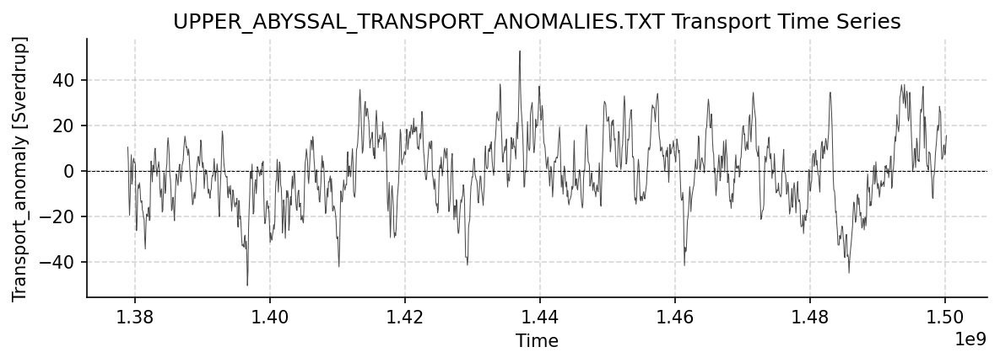
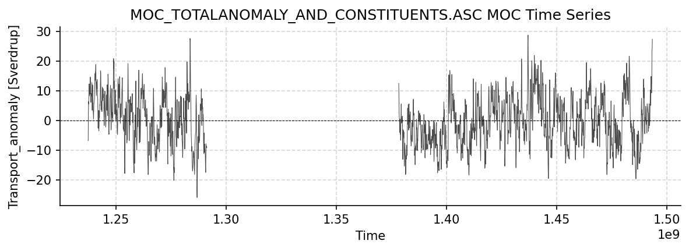

SAMBA Dataset Report
====================

Generated: 2026-02-06

This report covers all available SAMBA datasets.

Upper_Abyssal_Transport_Anomalies.txt
-------------------------------------

Dataset Overview
^^^^^^^^^^^^^^^^

- **Project**: South Atlantic MOC Basin-wide Array (SAMBA)
- **Institution**: Unknown
- **Description**: SAMBA 34S transport estimates dataset
- **Source File**: Upper_Abyssal_Transport_Anomalies.txt
- **Data Product**: Daily volume transport anomaly estimates for the upper and abyssal cells of the MOC
- **Time Coverage**: 1378987200.0 to 1500206400.0
- **Record Length**: 1,404 observations (121219200.0 years)
- **Sampling Frequency**: 2073600.0H

**Citation:**

    M. Kersalé et al., Highly variable upper and abyssal overturning cells in the South Atlantic. Sci. Adv. 6, eaba7573 (2020). DOI: 10.1126/sciadv.aba7573

Dataset Statistics
^^^^^^^^^^^^^^^^^^

- **Total Variables**: 2
- **Total Coordinates**: 1
- **Dataset Size**: 0.03 MB

Coordinate Information
^^^^^^^^^^^^^^^^^^^^^^

The following table shows information about the dataset coordinates:

+------------+-------------------+-----------------------------------------+------------------------------------+---------+------------+------------+-----------+
| Coordinate | Standardized Name | Description                             | Units                              | Size    | Min Value  | Max Value  | Missing % |
+============+===================+=========================================+====================================+=========+============+============+===========+
| TIME       | TIME              | Time elapsed since 1970-01-01T00:00:00Z | seconds since 1970-01-01T00:00:00Z | (1404,) | 2013-09-12 | 2017-07-16 | 0.0%      |
+------------+-------------------+-----------------------------------------+------------------------------------+---------+------------+------------+-----------+

Variable Mapping and Statistics
^^^^^^^^^^^^^^^^^^^^^^^^^^^^^^^

The following table shows the mapping from original variable names to standardized names,
along with key statistics for each variable.

+-------------------+-------------------+------------------------------------------------------------------------------------------------------------+-------+---------+-----------+-----------+-----------+
| Original Variable | Standardized Name | Description                                                                                                | Units | Size    | Min Value | Max Value | Missing % |
+===================+===================+============================================================================================================+=======+=========+===========+===========+===========+
| UPPER_TRANSPORT   | UPPER_TRANSPORT   | **Transport_anomaly**: Upper-cell volume transport anomaly (relative to record-length average of 17.3 Sv)  | Sv    | (1404,) | -50.28    | 52.69     | 0.0%      |
+-------------------+-------------------+------------------------------------------------------------------------------------------------------------+-------+---------+-----------+-----------+-----------+
| ABYSSAL_TRANSPORT | ABYSSAL_TRANSPORT | **Transport_anomaly**: Abyssal-cell volume transport anomaly (relative to record-length average of 7.8 Sv) | Sv    | (1404,) | -19.09    | 24.00     | 0.0%      |
+-------------------+-------------------+------------------------------------------------------------------------------------------------------------+-------+---------+-----------+-----------+-----------+

Dataset Visualization
^^^^^^^^^^^^^^^^^^^^^

   Time series plot for UPPER_ABYSSAL_TRANSPORT_ANOMALIES.TXT dataset.

Complete Metadata
^^^^^^^^^^^^^^^^^

The following metadata provides comprehensive information about this dataset:

- **Platform**: mooring
- **Platform Vocabulary**: https://vocab.nerc.ac.uk/collection/L06/
- **Time Coverage Start**: 1378987200.0
- **Time Coverage End**: 1500206400.0
- **Program**: SAMBA
- **Project**: South Atlantic MOC Basin-wide Array (SAMBA)
- **Contributor Name**: 
- **Contributor Email**: 
- **Contributor Id**: ftp://ftp.aoml.noaa.gov/phod/pub/SAM/2020_Kersale_etal_ScienceAdvances/
- **Contributor Role**: 
- **Web Link**: https://www.aoml.noaa.gov/phod/samoc
- **Comment**: Dataset accessed and processed via http://github.com/AMOCcommunity/amocatlas
- **Featuretype**: timeSeries
- **Description**: SAMBA 34S transport estimates dataset
- **Acknowledgement**: SAMBA data were collected and made freely available by the SAMOC international project and contributing national programs.
- **License**: CC-BY 4.0
- **Conventions**: CF-1.8, ACDD-1.3
- **Data Product**: Daily volume transport anomaly estimates for the upper and abyssal cells of the MOC
- **Variable Mapping**: [Complex metadata structure - 2 items]
- **Source File**: Upper_Abyssal_Transport_Anomalies.txt
- **Source Path**: /Users/eddifying/Cloudfree/github/AMOCatlas/data/Upper_Abyssal_Transport_Anomalies.txt
- **Amocatlas Datasource**: samba34s
- **Summary**: SAMBA 34S transport estimates dataset
- **Featuretype Vocabulary**: https://cfconventions.org/cf-conventions/v1.6.0/cf-conventions.html#_features_and_feature_types

Metadata Processing Changes
^^^^^^^^^^^^^^^^^^^^^^^^^^^

**Added by AMOCatlas processing:**

- **Time Coverage End**: 2023-12-31
- **Source Path**: /Users/eddifying/Cloudfree/github/AMOCatlas/data/Upper_Abyssal_Transport_Anomalies.txt
- **Program**: SAMBA
- **License**: CC-BY 4.0
- **Amocatlas Datasource**: samba34s
- **Source Url**: 
- **Project**: South Atlantic MOC Basin-wide Array (SAMBA)
- **Citation**: M. Kersalé et al., Highly variable upper and abyssal overturning cells in the South Atlantic. Sci. Adv. 6, eaba7573 (2020). DOI: 10.1126/sciadv.aba7573
- **Source File**: Upper_Abyssal_Transport_Anomalies.txt
- **Data Product**: Daily volume transport anomaly estimates for the upper and abyssal cells of the MOC
- **Platform Type**: 
- **Weblink**: 
- **Comment**: Dataset accessed and processed via http://github.com/AMOCcommunity/amocatlas
- **Description**: SAMBA 34S transport estimates dataset
- **Conventions**: CF-1.8, ACDD-1.3
- **Time Coverage Start**: 2001-06-01
- **Variable Mapping**: {'Upper-cell volume transport anomaly (relative to record-length average of 17.3 Sv)': 'UPPER_TRANSPORT', 'Abyssal-cell volume transport anomaly (relative to record-length average of 7.8 Sv)': 'ABYSSAL_TRANSPORT'}
- **Featuretype**: timeSeries
- **Acknowledgement**: SAMBA data were collected and made freely available by the SAMOC international project and contributing national programs.

MOC_TotalAnomaly_and_constituents.asc
-------------------------------------

Dataset Overview
^^^^^^^^^^^^^^^^

- **Project**: South Atlantic MOC Basin-wide Array (SAMBA)
- **Institution**: Unknown
- **Description**: SAMBA 34S transport estimates dataset
- **Source File**: MOC_TotalAnomaly_and_constituents.asc
- **Data Product**: Daily travel time values, calibrated to a nominal pressure of 1000 dbar, and bottom pressures from the two PIES/CPIES moorings
- **Time Coverage**: 1237464000.0 to 1493467200.0
- **Record Length**: 2,964 observations (256003200.0 years)
- **Sampling Frequency**: 2073600.0H

**Citation:**

    Meinen, C. S., Speich, S., Piola, A. R., Ansorge, I., Campos, E., Kersalé, M., et al. (2018). Meridional overturning circulation transport variability at 34.5°S during 2009–2017: Baroclinic and barotropic flows and the dueling influence of the boundaries. Geophysical Research Letters, 45, 4180–4188. https://doi.org/10.1029/2018GL077408

Dataset Statistics
^^^^^^^^^^^^^^^^^^

- **Total Variables**: 8
- **Total Coordinates**: 1
- **Dataset Size**: 0.20 MB

Coordinate Information
^^^^^^^^^^^^^^^^^^^^^^

The following table shows information about the dataset coordinates:

+------------+-------------------+-----------------------------------------+------------------------------------+---------+------------+------------+-----------+
| Coordinate | Standardized Name | Description                             | Units                              | Size    | Min Value  | Max Value  | Missing % |
+============+===================+=========================================+====================================+=========+============+============+===========+
| TIME       | TIME              | Time elapsed since 1970-01-01T00:00:00Z | seconds since 1970-01-01T00:00:00Z | (2964,) | 2009-03-19 | 2017-04-29 | 0.0%      |
+------------+-------------------+-----------------------------------------+------------------------------------+---------+------------+------------+-----------+

Variable Mapping and Statistics
^^^^^^^^^^^^^^^^^^^^^^^^^^^^^^^

The following table shows the mapping from original variable names to standardized names,
along with key statistics for each variable.

+----------------------+----------------------+---------------------------------------------------------------------------------------------+-------+---------+-----------+-----------+-----------+
| Original Variable    | Standardized Name    | Description                                                                                 | Units | Size    | Min Value | Max Value | Missing % |
+======================+======================+=============================================================================================+=======+=========+===========+===========+===========+
| MOC                  | MOC                  | **Transport_anomaly**: MOC Total Anomaly (relative to record-length average of 14.7 Sv)     | Sv    | (2964,) | -25.89    | 28.72     | 34.0%     |
+----------------------+----------------------+---------------------------------------------------------------------------------------------+-------+---------+-----------+-----------+-----------+
| RELATIVE_MOC         | RELATIVE_MOC         | **Transport_anomaly**: Relative (density gradient) contribution to the MOC anomaly          | Sv    | (2964,) | -19.69    | 16.51     | 34.0%     |
+----------------------+----------------------+---------------------------------------------------------------------------------------------+-------+---------+-----------+-----------+-----------+
| BAROTROPIC_MOC       | BAROTROPIC_MOC       | **Transport_anomaly**: Reference (bottom pressure gradient) contribution to the MOC anomaly | Sv    | (2964,) | -12.14    | 20.58     | 34.0%     |
+----------------------+----------------------+---------------------------------------------------------------------------------------------+-------+---------+-----------+-----------+-----------+
| EKMAN                | EKMAN                | **Transport_anomaly**: Ekman (wind) contribution to the MOC anomaly                         | Sv    | (2964,) | -15.65    | 20.30     | 34.0%     |
+----------------------+----------------------+---------------------------------------------------------------------------------------------+-------+---------+-----------+-----------+-----------+
| WESTERN_DENSITY      | WESTERN_DENSITY      | **Transport_anomaly**: Western density contribution to the MOC anomaly                      | Sv    | (2964,) | -16.32    | 6.87      | 34.0%     |
+----------------------+----------------------+---------------------------------------------------------------------------------------------+-------+---------+-----------+-----------+-----------+
| EASTERN_DENSITY      | EASTERN_DENSITY      | **Transport_anomaly**: Eastern density contribution to the MOC anomaly                      | Sv    | (2964,) | -16.67    | 13.94     | 34.0%     |
+----------------------+----------------------+---------------------------------------------------------------------------------------------+-------+---------+-----------+-----------+-----------+
| WESTERN_BOT_PRESSURE | WESTERN_BOT_PRESSURE | **Transport_anomaly**: Western bottom pressure contribution to the MOC anomaly              | Sv    | (2964,) | -13.60    | 21.73     | 34.0%     |
+----------------------+----------------------+---------------------------------------------------------------------------------------------+-------+---------+-----------+-----------+-----------+
| EASTERN_BOT_PRESSURE | EASTERN_BOT_PRESSURE | **Transport_anomaly**: Eastern bottom pressure contribution to the MOC anomaly              | Sv    | (2964,) | -12.93    | 11.15     | 34.0%     |
+----------------------+----------------------+---------------------------------------------------------------------------------------------+-------+---------+-----------+-----------+-----------+

Dataset Visualization
^^^^^^^^^^^^^^^^^^^^^

   Time series plot for MOC_TOTALANOMALY_AND_CONSTITUENTS.ASC dataset.

Complete Metadata
^^^^^^^^^^^^^^^^^

The following metadata provides comprehensive information about this dataset:

- **Platform**: mooring
- **Platform Vocabulary**: https://vocab.nerc.ac.uk/collection/L06/
- **Time Coverage Start**: 1237464000.0
- **Time Coverage End**: 1493467200.0
- **Program**: SAMBA
- **Project**: South Atlantic MOC Basin-wide Array (SAMBA)
- **Contributor Name**: 
- **Contributor Email**: 
- **Contributor Id**: https://www.aoml.noaa.gov/phod/SAMOC_international/documents/
- **Contributor Role**: 
- **Web Link**: https://www.aoml.noaa.gov/phod/samoc
- **Comment**: Dataset accessed and processed via http://github.com/AMOCcommunity/amocatlas
- **Featuretype**: timeSeries
- **Description**: SAMBA 34S transport estimates dataset
- **Acknowledgement**: SAMBA data were collected and made freely available by the SAMOC international project and contributing national programs.
- **License**: CC-BY 4.0
- **Conventions**: CF-1.8, ACDD-1.3
- **Data Product**: Daily travel time values, calibrated to a nominal pressure of 1000 dbar, and bottom pressures from the two PIES/CPIES moorings
- **Variable Mapping**: [Complex metadata structure - 8 items]
- **Source File**: MOC_TotalAnomaly_and_constituents.asc
- **Source Path**: /Users/eddifying/Cloudfree/github/AMOCatlas/data/MOC_TotalAnomaly_and_constituents.asc
- **Amocatlas Datasource**: samba34s
- **Summary**: SAMBA 34S transport estimates dataset
- **Featuretype Vocabulary**: https://cfconventions.org/cf-conventions/v1.6.0/cf-conventions.html#_features_and_feature_types

Metadata Processing Changes
^^^^^^^^^^^^^^^^^^^^^^^^^^^

**Added by AMOCatlas processing:**

- **Time Coverage End**: 2023-12-31
- **Source Path**: /Users/eddifying/Cloudfree/github/AMOCatlas/data/MOC_TotalAnomaly_and_constituents.asc
- **Program**: SAMBA
- **License**: CC-BY 4.0
- **Amocatlas Datasource**: samba34s
- **Source Url**: 
- **Project**: South Atlantic MOC Basin-wide Array (SAMBA)
- **Citation**: Meinen, C. S., Speich, S., Piola, A. R., Ansorge, I., Campos, E., Kersalé, M., et al. (2018). Meridional overturning circulation transport variability at 34.5°S during 2009–2017: Baroclinic and barotropic flows and the dueling influence of the boundaries. Geophysical Research Letters, 45, 4180–4188. https://doi.org/10.1029/2018GL077408
- **Source File**: MOC_TotalAnomaly_and_constituents.asc
- **Data Product**: Daily travel time values, calibrated to a nominal pressure of 1000 dbar, and bottom pressures from the two PIES/CPIES moorings
- **Platform Type**: 
- **Weblink**: 
- **Comment**: Dataset accessed and processed via http://github.com/AMOCcommunity/amocatlas
- **Description**: SAMBA 34S transport estimates dataset
- **Conventions**: CF-1.8, ACDD-1.3
- **Time Coverage Start**: 2001-06-01
- **Variable Mapping**: {'Total MOC anomaly (relative to record-length average of 14.7 Sv)': 'MOC', 'Relative (density gradient) contribution to the MOC anomaly': 'RELATIVE_MOC', 'Reference (bottom pressure gradient) contribution to the MOC anomaly': 'BAROTROPIC_MOC', 'Ekman (wind) contribution to the MOC anomaly': 'EKMAN', 'Western density contribution to the MOC anomaly': 'WESTERN_DENSITY', 'Eastern density contribution to the MOC anomaly': 'EASTERN_DENSITY', 'Western bottom pressure contribution to the MOC anomaly': 'WESTERN_BOT_PRESSURE', 'Eastern bottom pressure contribution to the MOC anomaly': 'EASTERN_BOT_PRESSURE'}
- **Featuretype**: timeSeries
- **Acknowledgement**: SAMBA data were collected and made freely available by the SAMOC international project and contributing national programs.
