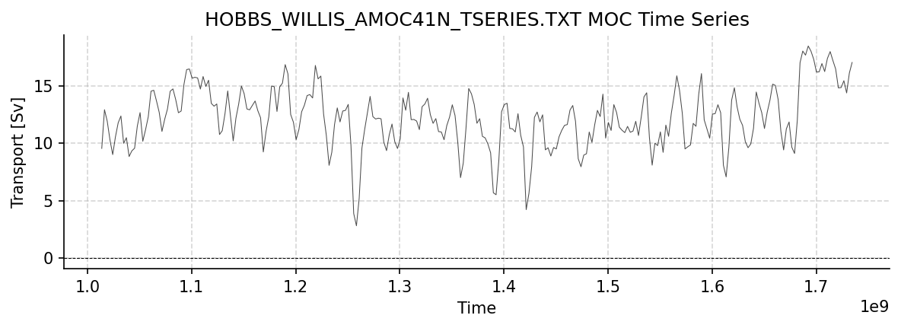

WH41N Dataset Report
====================

Generated: 2026-02-06 23:23:18

This report covers all available WH41N datasets.

hobbs_willis_amoc41N_tseries.txt
--------------------------------

Dataset Overview
^^^^^^^^^^^^^^^^

- **Project**: Atlantic Meridional Overturning Circulation Near 41N from Altimetry and Argo Observations
- **Description**: 41N transport estimates dataset
- **DOI**: http://doi.org/10.5281/zenodo.8170365
- **Source File**: hobbs_willis_amoc41N_tseries.txt
- **Data Product**: Atlantic Meridional Overturning Circulation Near 41N from Altimetry and Argo Observations
- **Time Coverage**: 2002-02-15 to 2024-12-16
- **Record Length**: 275 observations (22.8 years)
- **Sampling Frequency**: monthly

Dataset Statistics
^^^^^^^^^^^^^^^^^^

- **Total Variables**: 4
- **Total Coordinates**: 1
- **Dataset Size**: 0.01 MB

Coordinate Information
^^^^^^^^^^^^^^^^^^^^^^

The following table shows information about the dataset coordinates:

+------------+-------------------+-----------------------------------------+------------------------------------+--------+------------+------------+
| Coordinate | Standardized Name | Description                             | Units                              | Size   | Min Value  | Max Value  |
+============+===================+=========================================+====================================+========+============+============+
| TIME       | TIME              | Time elapsed since 1970-01-01T00:00:00Z | seconds since 1970-01-01T00:00:00Z | (275,) | 2002-02-15 | 2024-12-16 |
+------------+-------------------+-----------------------------------------+------------------------------------+--------+------------+------------+

Variable Mapping and Statistics
^^^^^^^^^^^^^^^^^^^^^^^^^^^^^^^

The following table shows the mapping from original variable names to standardized names,
along with key statistics for each variable.

+-----------------------------------------------------+-------------------+--------------------------+-------+--------+-----------+-----------+-----------+
| Original Variable                                   | Standardized Name | Description              | Units | Size   | Min Value | Max Value | Missing % |
+=====================================================+===================+==========================+=======+========+===========+===========+===========+
| Ekman Volume Transport (Sverdrups)                  | TRANS_EKMAN       | No description available | 1     | (275,) | -8.79     | 0.51      | 0.0%      |
+-----------------------------------------------------+-------------------+--------------------------+-------+--------+-----------+-----------+-----------+
| Northward Geostrophic Transport (Sverdrups)         | TRANS_GEO         | No description available | 1     | (275,) | 6.75      | 21.39     | 0.0%      |
+-----------------------------------------------------+-------------------+--------------------------+-------+--------+-----------+-----------+-----------+
| Meridional Overturning Volume Transport (Sverdrups) | MOC               | No description available | 1     | (275,) | 2.82      | 18.47     | 0.0%      |
+-----------------------------------------------------+-------------------+--------------------------+-------+--------+-----------+-----------+-----------+
| Meridional Overturning Heat Transport (PetaWatts)   | MHT               | No description available | 1     | (275,) | -0.07     | 0.90      | 0.0%      |
+-----------------------------------------------------+-------------------+--------------------------+-------+--------+-----------+-----------+-----------+

Dataset Visualization
^^^^^^^^^^^^^^^^^^^^^

   Time series plot for HOBBS_WILLIS_AMOC41N_TSERIES.TXT dataset.

Complete Metadata
^^^^^^^^^^^^^^^^^

The following metadata provides comprehensive information about this dataset:

- **Platform**: Argo floats
- **Platform Vocabulary**: https://vocab.nerc.ac.uk/collection/L06/
- **Time Coverage Start**: 2002-02-15
- **Time Coverage End**: 2024-12-16
- **Program**: 41N
- **Project**: Atlantic Meridional Overturning Circulation Near 41N from Altimetry and Argo Observations
- **Doi**: https://doi.org/10.5281/zenodo.8170365
- **Web Link**: https://zenodo.org/records/14681441
- **Comment**: Dataset accessed and processed via http://github.com/AMOCcommunity/amocatlas
- **Featuretype**: timeSeries
- **Acknowledgement**: None
- **Paper**: Willis, J. K., and Hobbs, W. R., Atlantic Meridional Overturning Circulation Near 41N from Altimetry and Argo Observations. Dataset access [2025-05-27] at 10.5281/zenodo.8170366.
- **Data Product**: Atlantic Meridional Overturning Circulation Near 41N from Altimetry and Argo Observations
- **Source File**: hobbs_willis_amoc41N_tseries.txt
- **Source Path**: /Users/eddifying/Cloudfree/github/AMOCatlas/data/hobbs_willis_amoc41N_tseries.txt
- **Amocatlas Datasource**: wh41n
- **Applied Variable Mapping**: [Complex metadata structure - 4 items]
- **Description**: 41N transport estimates dataset
- **Acknowledgment**: These data were collected and made freely available by the International Argo Program and the national programs that contribute to it. (https://argo.ucsd.edu, https://www.ocean-ops.org). The Argo Program is part of the Global Ocean Observing System.
- **License**: None
- **Convections**: CF-1.8, ACDD-1.3
- **Summary**: 41N transport estimates dataset
- **Featuretype Vocabulary**: https://cfconventions.org/cf-conventions/v1.6.0/cf-conventions.html#_features_and_feature_types

Metadata Processing Changes
^^^^^^^^^^^^^^^^^^^^^^^^^^^

**Added by AMOCatlas processing:**

- **Source Path**: /Users/eddifying/Cloudfree/github/AMOCatlas/data/hobbs_willis_amoc41N_tseries.txt
- **Comment**: Dataset accessed and processed via http://github.com/AMOCcommunity/amocatlas
- **Acknowledgement**: None
- **Data Product**: Atlantic Meridional Overturning Circulation Near 41N from Altimetry and Argo Observations
- **Amocatlas Datasource**: wh41n
- **Doi**: 10.5281/zenodo.8170365
- **Paper**: Willis, J. K., and Hobbs, W. R., Atlantic Meridional Overturning Circulation Near 41N from Altimetry and Argo Observations. Dataset access [2025-05-27] at 10.5281/zenodo.8170366.
- **Weblink**: 
- **Source File**: hobbs_willis_amoc41N_tseries.txt
- **Project**: Atlantic Meridional Overturning Circulation Near 41N from Altimetry and Argo Observations

trans_ARGO_ERA5.nc
------------------

Dataset Overview
^^^^^^^^^^^^^^^^

- **Project**: Atlantic Meridional Overturning Circulation Near 41N from Altimetry and Argo Observations
- **Description**: 41N transport estimates dataset
- **Acknowledgement**: This study has been conducted using E.U. Copernicus Marine Service Information; https://doi.org/10.48670/moi-00149 and https://doi.org/10.48670/moi-00148. These data were collected and made freely available by the International Argo Program and the national programs that contribute to it. (https://argo.ucsd.edu, https://www.ocean-ops.org). The Argo Program is part of the Global Ocean Observing System.
- **DOI**: http://doi.org/10.5281/zenodo.8170365
- **Source File**: trans_ARGO_ERA5.nc
- **Time Coverage**: 200201.0 to 202412.0
- **Record Length**: 276 observations (22.9 years)
- **Sampling Frequency**: daily

Dataset Statistics
^^^^^^^^^^^^^^^^^^

- **Total Variables**: 3
- **Total Coordinates**: 4
- **Dataset Size**: 270.89 MB

Coordinate Information
^^^^^^^^^^^^^^^^^^^^^^

The following table shows information about the dataset coordinates:

+------------+-------------------+---------------------------+---------------+--------+-----------+-----------+
| Coordinate | Standardized Name | Description               | Units         | Size   | Min Value | Max Value |
+============+===================+===========================+===============+========+===========+===========+
| depth      | depth             | Depth below ocean surface | 1             | (201,) | 0         | 2e+03     |
+------------+-------------------+---------------------------+---------------+--------+-----------+-----------+
| lon        | lon               | longitude                 | degrees_east  | (320,) | 280       | 360       |
+------------+-------------------+---------------------------+---------------+--------+-----------+-----------+
| time       | time              | time                      | YYYYMM        | (276,) | 2e+05     | 2.02e+05  |
+------------+-------------------+---------------------------+---------------+--------+-----------+-----------+
| lat        | lat               | latitude                  | degrees_north | (4,)   | 40        | 41.5      |
+------------+-------------------+---------------------------+---------------+--------+-----------+-----------+

Variable Mapping and Statistics
^^^^^^^^^^^^^^^^^^^^^^^^^^^^^^^

The following table shows the mapping from original variable names to standardized names,
along with key statistics for each variable.

No variable mapping information available.

Complete Metadata
^^^^^^^^^^^^^^^^^

The following metadata provides comprehensive information about this dataset:

- **Title**: transport from ARGO/SSH data
- **Platform**: Argo floats
- **Platform Vocabulary**: https://vocab.nerc.ac.uk/collection/L06/
- **Time Coverage Start**: 200201.0
- **Time Coverage End**: 202412.0
- **Program**: 41N
- **Project**: Atlantic Meridional Overturning Circulation Near 41N from Altimetry and Argo Observations
- **Doi**: https://doi.org/10.5281/zenodo.8170365
- **Web Link**: https://zenodo.org/records/14681441
- **Comment**: Dataset accessed and processed via http://github.com/AMOCcommunity/amocatlas
- **Date Created**: Thu 16 Jan 2025 16:09:16 AEDT
- **Featuretype**: timeSeries
- **Acknowledgement**: This study has been conducted using E.U. Copernicus Marine Service Information; https://doi.org/10.48670/moi-00149 and https://doi.org/10.48670/moi-00148. These data were collected and made freely available by the International Argo Program and the national programs that contribute to it. (https://argo.ucsd.edu, https://www.ocean-ops.org). The Argo Program is part of the Global Ocean Observing System.
- **Paper**: Willis, J. K., and Hobbs, W. R., Atlantic Meridional Overturning Circulation Near 41N from Altimetry and Argo Observations. Dataset access [2025-05-27] at 10.5281/zenodo.8170366.
- **Reference Temp**: kelvin
- **Wind Stress**: ERA5
- **Source File**: trans_ARGO_ERA5.nc
- **Source Path**: /Users/eddifying/Cloudfree/github/AMOCatlas/data/trans_ARGO_ERA5.nc
- **Amocatlas Datasource**: wh41n
- **Description**: 41N transport estimates dataset
- **Acknowledgment**: These data were collected and made freely available by the International Argo Program and the national programs that contribute to it. (https://argo.ucsd.edu, https://www.ocean-ops.org). The Argo Program is part of the Global Ocean Observing System.
- **License**: None
- **Convections**: CF-1.8, ACDD-1.3
- **Summary**: 41N transport estimates dataset
- **Featuretype Vocabulary**: https://cfconventions.org/cf-conventions/v1.6.0/cf-conventions.html#_features_and_feature_types

Metadata Processing Changes
^^^^^^^^^^^^^^^^^^^^^^^^^^^

**Added by AMOCatlas processing:**

- **Comment**: Dataset accessed and processed via http://github.com/AMOCcommunity/amocatlas
- **Acknowledgement**: This study has been conducted using E.U. Copernicus Marine Service Information; https://doi.org/10.48670/moi-00149 and https://doi.org/10.48670/moi-00148. These data were collected and made freely available by the International Argo Program and the national programs that contribute to it. (https://argo.ucsd.edu, https://www.ocean-ops.org). The Argo Program is part of the Global Ocean Observing System.
- **Amocatlas Datasource**: wh41n
- **Doi**: 10.5281/zenodo.8170365
- **Paper**: Willis, J. K., and Hobbs, W. R., Atlantic Meridional Overturning Circulation Near 41N from Altimetry and Argo Observations. Dataset access [2025-05-27] at 10.5281/zenodo.8170366.
- **Weblink**: 
- **Source Path**: /Users/eddifying/Cloudfree/github/AMOCatlas/data/trans_ARGO_ERA5.nc
- **Project**: Atlantic Meridional Overturning Circulation Near 41N from Altimetry and Argo Observations

**Modified by AMOCatlas processing:**

- **Source File**: trans_ARGO_ERA5.nc

Q_ARGO_obs_dens_2000depth_ERA5.nc
---------------------------------

Dataset Overview
^^^^^^^^^^^^^^^^

- **Project**: Atlantic Meridional Overturning Circulation Near 41N from Altimetry and Argo Observations
- **Description**: 41N transport estimates dataset
- **Acknowledgement**: This study has been conducted using E.U. Copernicus Marine Service Information; https://doi.org/10.48670/moi-00149 and https://doi.org/10.48670/moi-00148. These data were collected and made freely available by the International Argo Program and the national programs that contribute to it. (https://argo.ucsd.edu, https://www.ocean-ops.org). The Argo Program is part of the Global Ocean Observing System.
- **DOI**: http://doi.org/10.5281/zenodo.8170365
- **Source File**: Q_ARGO_obs_dens_2000depth_ERA5.nc
- **Data Product**: Time series of heat transport based on various assumptions about the temperature of the ocean for depths below 2000m
- **Time Coverage**: 200201.0 to 202412.0
- **Record Length**: 276 observations (22.9 years)
- **Sampling Frequency**: daily

Dataset Statistics
^^^^^^^^^^^^^^^^^^

- **Total Variables**: 3
- **Total Coordinates**: 5
- **Dataset Size**: 270.90 MB

Coordinate Information
^^^^^^^^^^^^^^^^^^^^^^

The following table shows information about the dataset coordinates:

+------------+-------------------+----------------------------+---------------+--------+-----------+-----------+
| Coordinate | Standardized Name | Description                | Units         | Size   | Min Value | Max Value |
+============+===================+============================+===============+========+===========+===========+
| depth      | depth             | Depth below ocean surface  | 1             | (201,) | 0         | 2e+03     |
+------------+-------------------+----------------------------+---------------+--------+-----------+-----------+
| lon        | lon               | longitude                  | degrees_east  | (320,) | 280       | 360       |
+------------+-------------------+----------------------------+---------------+--------+-----------+-----------+
| lat        | lat               | latitude                   | degrees_north | (4,)   | 40        | 41.5      |
+------------+-------------------+----------------------------+---------------+--------+-----------+-----------+
| time       | time              | time                       | YYYYMM        | (276,) | 2e+05     | 2.02e+05  |
+------------+-------------------+----------------------------+---------------+--------+-----------+-----------+
| Hpar       | Hpar              | deep ocean volumetric Heat | J/m^3         | (4,)   | 1.12e+09  | 1.13e+09  |
+------------+-------------------+----------------------------+---------------+--------+-----------+-----------+

Variable Mapping and Statistics
^^^^^^^^^^^^^^^^^^^^^^^^^^^^^^^

The following table shows the mapping from original variable names to standardized names,
along with key statistics for each variable.

No variable mapping information available.

Complete Metadata
^^^^^^^^^^^^^^^^^

The following metadata provides comprehensive information about this dataset:

- **Title**: heat transport from ARGO/SSH data
- **Platform**: Argo floats
- **Platform Vocabulary**: https://vocab.nerc.ac.uk/collection/L06/
- **Time Coverage Start**: 200201.0
- **Time Coverage End**: 202412.0
- **Program**: 41N
- **Project**: Atlantic Meridional Overturning Circulation Near 41N from Altimetry and Argo Observations
- **Doi**: https://doi.org/10.5281/zenodo.8170365
- **Web Link**: https://zenodo.org/records/14681441
- **Comment**: Dataset accessed and processed via http://github.com/AMOCcommunity/amocatlas
- **Date Created**: Thu 16 Jan 2025 16:09:16 AEDT
- **Featuretype**: timeSeries
- **Acknowledgement**: This study has been conducted using E.U. Copernicus Marine Service Information; https://doi.org/10.48670/moi-00149 and https://doi.org/10.48670/moi-00148. These data were collected and made freely available by the International Argo Program and the national programs that contribute to it. (https://argo.ucsd.edu, https://www.ocean-ops.org). The Argo Program is part of the Global Ocean Observing System.
- **Paper**: Willis, J. K., and Hobbs, W. R., Atlantic Meridional Overturning Circulation Near 41N from Altimetry and Argo Observations. Dataset access [2025-05-27] at 10.5281/zenodo.8170366.
- **Data Product**: Time series of heat transport based on various assumptions about the temperature of the ocean for depths below 2000m
- **Reference Temp**: kelvin
- **Wind Stress**: ERA5
- **Source File**: Q_ARGO_obs_dens_2000depth_ERA5.nc
- **Source Path**: /Users/eddifying/Cloudfree/github/AMOCatlas/data/Q_ARGO_obs_dens_2000depth_ERA5.nc
- **Amocatlas Datasource**: wh41n
- **Description**: 41N transport estimates dataset
- **Acknowledgment**: These data were collected and made freely available by the International Argo Program and the national programs that contribute to it. (https://argo.ucsd.edu, https://www.ocean-ops.org). The Argo Program is part of the Global Ocean Observing System.
- **License**: None
- **Convections**: CF-1.8, ACDD-1.3
- **Summary**: 41N transport estimates dataset
- **Featuretype Vocabulary**: https://cfconventions.org/cf-conventions/v1.6.0/cf-conventions.html#_features_and_feature_types

Metadata Processing Changes
^^^^^^^^^^^^^^^^^^^^^^^^^^^

**Added by AMOCatlas processing:**

- **Comment**: Dataset accessed and processed via http://github.com/AMOCcommunity/amocatlas
- **Acknowledgement**: This study has been conducted using E.U. Copernicus Marine Service Information; https://doi.org/10.48670/moi-00149 and https://doi.org/10.48670/moi-00148. These data were collected and made freely available by the International Argo Program and the national programs that contribute to it. (https://argo.ucsd.edu, https://www.ocean-ops.org). The Argo Program is part of the Global Ocean Observing System.
- **Data Product**: Time series of heat transport based on various assumptions about the temperature of the ocean for depths below 2000m
- **Amocatlas Datasource**: wh41n
- **Doi**: 10.5281/zenodo.8170365
- **Paper**: Willis, J. K., and Hobbs, W. R., Atlantic Meridional Overturning Circulation Near 41N from Altimetry and Argo Observations. Dataset access [2025-05-27] at 10.5281/zenodo.8170366.
- **Weblink**: 
- **Source Path**: /Users/eddifying/Cloudfree/github/AMOCatlas/data/Q_ARGO_obs_dens_2000depth_ERA5.nc
- **Project**: Atlantic Meridional Overturning Circulation Near 41N from Altimetry and Argo Observations

**Modified by AMOCatlas processing:**

- **Source File**: Q_ARGO_obs_dens_2000depth_ERA5.nc
